<div align="center">
  
    <h1>ES6</h1>
</div>

<h2>Table of contents<h2>

- [Callback & Promises:](#callback--promises)
  - [The Callback Hell:](#the-callback-hell)
  - [Promises:](#promises)
- [XHR & AJAX:](#xhr--ajax)
  - [fetch](#fetch)
- [Async & Await](#async--await)
- [Prototypes, Classes, & The New Operator](#prototypes-classes--the-new-operator)
- [Module:](#module)

## Callback & Promises:

Javascript is **a single threaded language** yet it can handle doing asynchronous stuff like

```js
console.log('I happen First!');
setTimeOut(() => {
	console.log('I happen Third!');
}, 3000);
console.log('I happen Second!');

///// OUTPUT:
//I happen First!
//I happen Second!
//I happen Third!
```

haven't you ever wonder HOW??
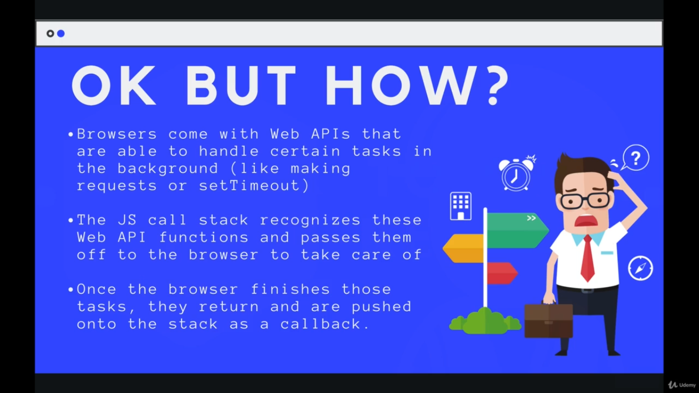

### The Callback Hell:

<br>

let's have an example where we have only a button on the screen and we're moving it horizontally

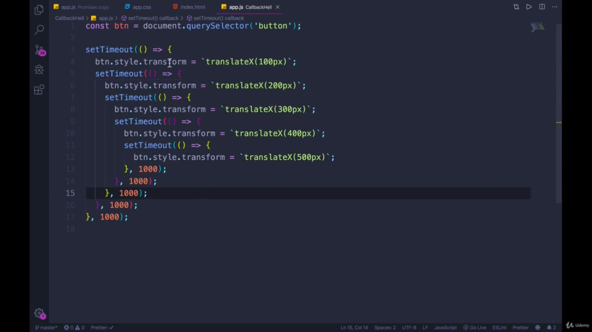

this is what a callback hell looks like, a function calling back a function, calling back a function,calling back a function ...etc

if we wanted to write this to look a little nicer it shall look like this

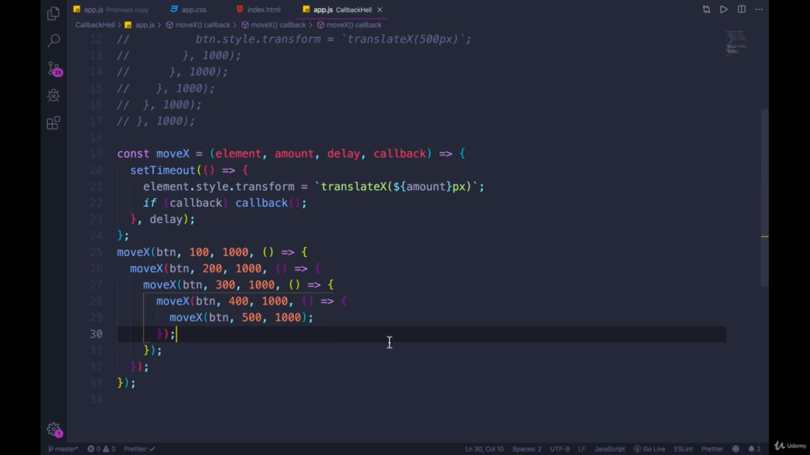

let's trigger an action to stop the button if it's about to get outside the screen

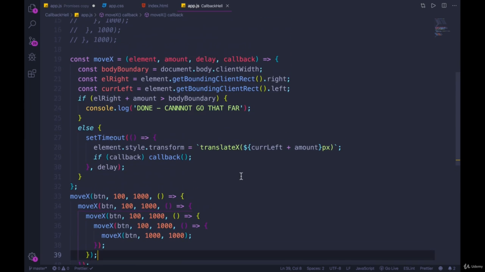

```js
//NB:
.clientWidth //returns the width of the screen

.getBoundingclientRect // returns dimension and position related information about selected element
```

Now let's change this a little so instead of having just a straight forward callback, we'll have 2 callbacks, one for if we can go further to the right and one if we reached the edge

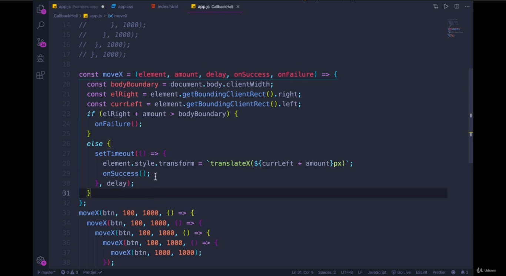

<br>

<h4>NB:</h4>
- there's a minor issue in our code here because of the timeout, the dimensions being sent to our function are not sync with our button move , one way around this is like this

<br><br>

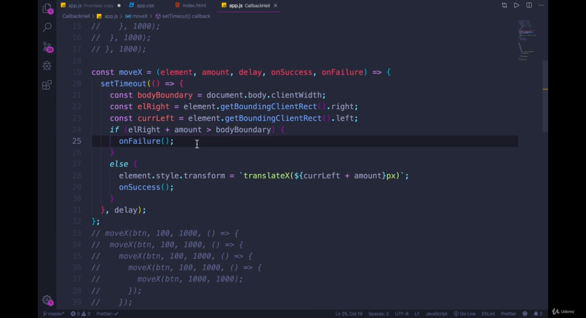
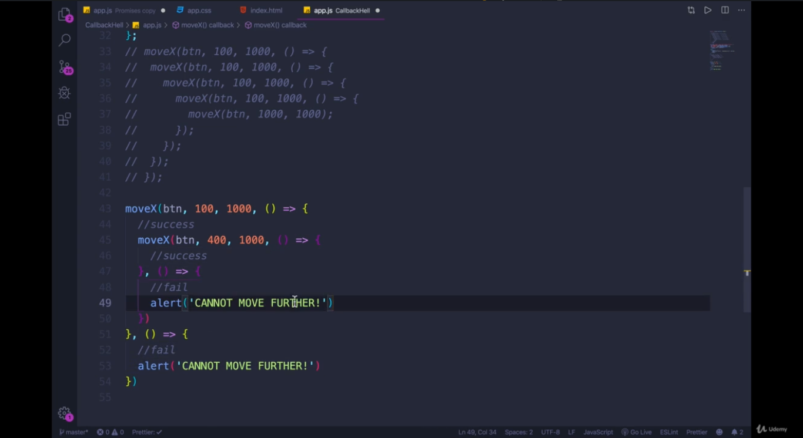
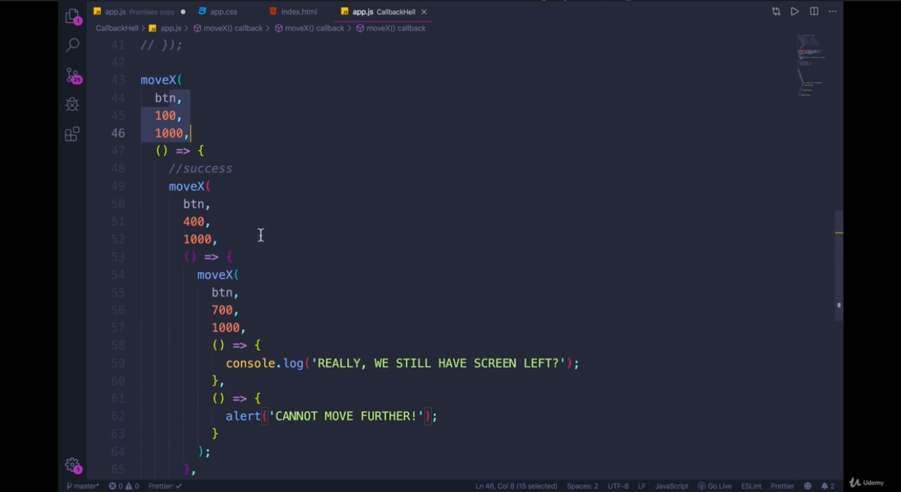
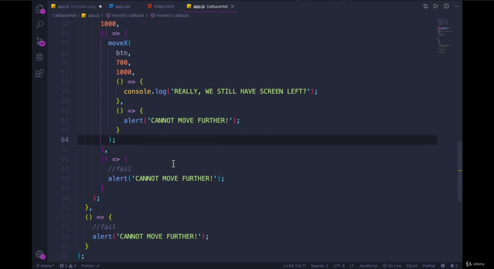

Can't you sense it yet? when you had one call back it was barely bearable but with two call backs it gets ugly and super looooooong, enter promises

### Promises:

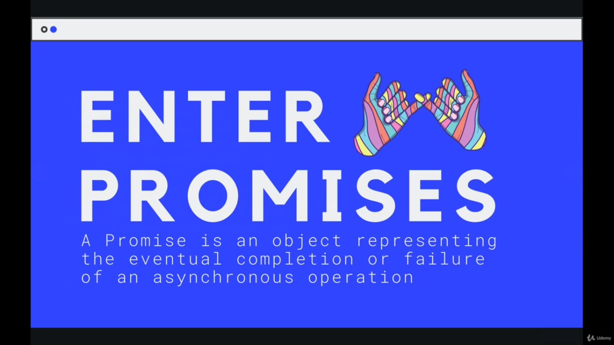

promise is a pattern for writing async code

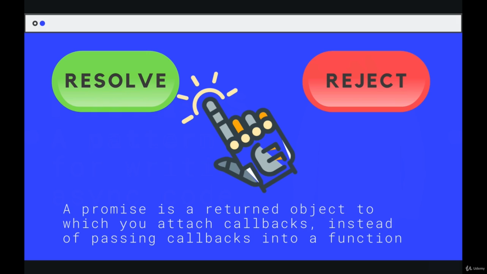

this is how our long code would look like with promises

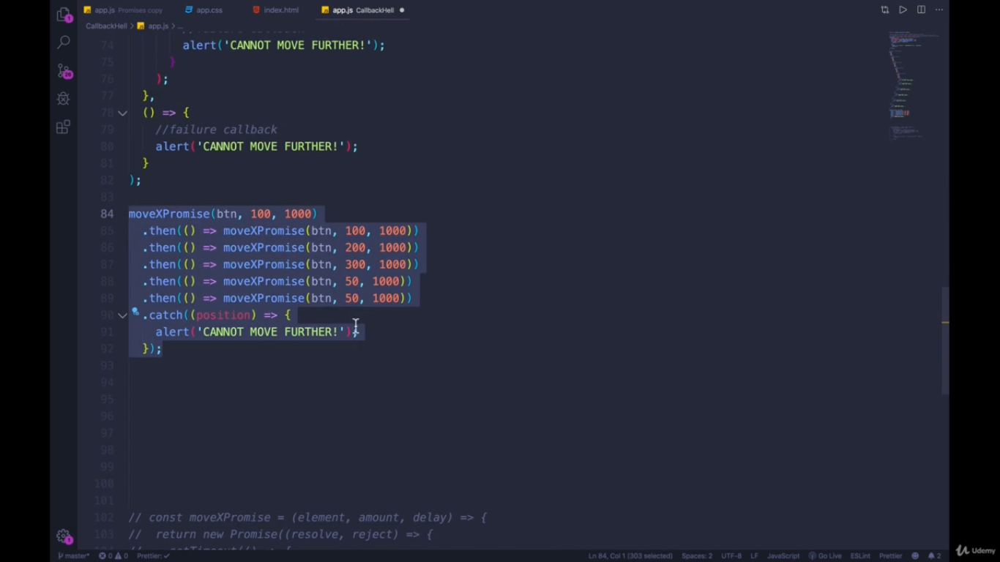

ok so now we understand why promises are useful, but how do we write a promise?

```js
let willGetYouADog = new Promise((resolve, reject) => {
	//promise always takes a callback function with two param resolve and reject
	let rand = Math.random();
	if (rand > 0.5) {
		resolve();
	} else {
		reject();
	}
});
console.log('willGetYouADog', willGetYouADog);

//returns either one of two objects
// Promise {<fulfilled>: undefined}
// Promise {<rejected>: undefined}
```

<h5>NB:</h5>
by default promise status is pending

```js
let willGetYouADog = new Promise((resolve, reject) => {
	//promise always takes a callback function with two param resolve and reject
	let rand = Math.random();
	if (rand > 0.5) {
		resolve();
	} else {
		reject();
	}
});

//to define what to do incase of resolve or rejection

willGetYouADog.then(() => {
	console.log("ok we're buying a dog");
});

willGetYouADog.catch(() => {
	console.log("nope we're getting a bird");
});

//this can also be written like this , which is more typical

/*

willGetYouADog.then(() => {
    console.log("ok we're buying a dog");
}).catch(() => {
    console.log("nope we're getting a bird");
});

*/
```

```js
let willGetYouADog = new Promise((resolve, reject) => {
	setTimeout(() => {
		//we added a setTimeout to simulate sending a request and waiting for it to come back or waiting for an animation to finish

		let rand = Math.random();
		if (rand > 0.5) {
			resolve();
		} else {
			reject();
		}
	}, 5000);
});
willGetYouADog
	.then(() => {
		console.log("ok we're buying a dog");
	})
	.catch(() => {
		console.log("nope we're getting a bird");
	});
```

one thing that is usually done is returning a promise from a function

```js
const makeDogPromise = () => {
	return new Promise((resolve, reject) => {
		setTimeout(() => {
			let rand = Math.random();
			if (rand > 0.5) {
				resolve();
			} else {
				reject();
			}
		}, 5000);
	});
};
makeDogPromise()
	.then(() => {
		console.log("ok we're buying a dog");
	})
	.catch(() => {
		console.log("nope we're getting a bird");
	});
```

---

<h3>
You can send and receive data inside your resolve and reject, this is useful when dealing with a real project as you'd want to know the reason if your promise was rejected
</h3>

```js
//Fake request Example:

const fakeRequest = (url) => {
	return new Promise((resolve, reject) => {
		setTimeout(() => {
			let rand = Math.random();

			if (rand < 0.3) {
				reject({ status: 404 });
			} else {
				let pages = {
					'/users': [
						{ id: 1, username: 'nene' },
						{ id: 2, username: 'bebo' },
					],
					'/about': 'this is the about page data',
				};

				let data = pages[url];

				resolve({ status: 200, data });
			}
		}, 1000);
	});
};
fakeRequest('/about')
	.then((res) => {
		console.log(
			`ABOUT REQUEST : RESOLVED REQUEST',status code: ${res.status}, data:${res.data}`, //'RESOLVED REQUEST',status code: 200, data:this is the about page data
		);
	})
	.catch((res) => {
		console.log(`ABOUT REQUEST : REJECTED REQUEST,status : ${res.status}`);
	});
```

<h4>NB: res is the data passed by the resolve or reject, then gets data from resolve and catch from reject</h4>

```js
const fakeRequest = (url) => {
	return new Promise((resolve, reject) => {
		setTimeout(() => {
			const pages = {
				'/users': [
					{ id: 1, username: 'nene' },
					{ id: 2, username: 'bebo' },
				],
				'/about': 'this is the about page data',
			};

			const data = pages[url];
			// console.log("fakeRequest -> data", data);
			// console.log("fakeRequest -> pages[url]", pages[url]);
			if (data) {
				resolve({ status: 200, data });
			} else {
				reject({ status: 404 });
			}
		}, 1000);
	});
};
fakeRequest('/goaafs')
	.then((res) => {
		//REJECTED REQUEST,status : 404

		console.log(
			`RESOLVED REQUEST',status code: ${res.status}, data:${res.data}`, //'RESOLVED REQUEST',status code: 200, data:this is the about page data
		);
	})
	.catch((res) => {
		console.log(`REJECTED REQUEST,status : ${res.status}`);
	});
```

```js
const fakeRequest = (url) => {
	return new Promise((resolve, reject) => {
		setTimeout(() => {
			const pages = {
				'/users': [
					{ id: 1, username: 'nene' },
					{ id: 2, username: 'bebo' },
				],
				'/about': 'this is the about page data',
			};

			const data = pages[url];
			// console.log("fakeRequest -> data", data);
			// console.log("fakeRequest -> pages[url]", pages[url]);
			if (data) {
				resolve({ status: 200, data });
			} else {
				reject({ status: 404 });
			}
		}, 1000);
	});
};

fakeRequest('/users')
	.then((res) => {
		console.log('data:', res.data); //data: [ { id: 1, username: 'nene' }, { id: 2, username: 'bebo' } ]
		console.log('status:', res.status); //status: 200
		console.log('request worked!'); //request worked!
	})
	.catch((res) => {
		console.log(`USER REQUEST : REJECTED REQUEST,status : ${res.status}`);
	});

// got object object when i used template literals, dkw :(
```

```js
const fakeRequest = (url) => {
	return new Promise((resolve, reject) => {
		setTimeout(() => {
			const pages = {
				'/users': [
					{ id: 1, username: 'nene' },
					{ id: 2, username: 'bebo' },
				],
				'/users/1': {
					id: 1,
					username: 'nene',
					upvotes: 360,
					city: 'Lisbon',
					topPostId: 454321,
				},
				'/users/2': {
					id: 2,
					username: 'bebo',
					upvotes: 5560,
					city: 'Cyber City',
				},
				'/posts/454321': {
					id: 454321,
					title: 'ladies and gents, may i introduce my pet pig, Hamlet',
				},
				'/about': 'this is the about page data',
			};

			const data = pages[url];
			if (data) {
				resolve({ status: 200, data });
			} else {
				reject({ status: 404 });
			}
		}, 1000);
	});
};

fakeRequest('/users').then((res) => {
	console.log('res', res); //{ status: 200, data: [ { id: 1, username: 'nene' }, { id: 2, username: 'bebo' } ] }

	console.log('data:', res.data[0].id); // 1
	const firId = res.data[0].id;

	fakeRequest(`/users/${firId}`).then((res2) => {
		console.log('res2 : ', res2); //res2 :  { status: 200, data:  { id: 1, username: 'nene',upvotes: 360, city: 'Lisbon',topPostId: 454321 } }
		console.log(res2.data.topPostId); //454321
		const topPost = res2.data.topPostId;

		fakeRequest(`/posts/${topPost}`).then((res3) => {
			console.log(res3); //{ status: 200, data:  { id: 454321, title: 'ladies and gents, may i introduce my pet pig, Hamlet' } }
		});
	});
});
```

THIS IS THE SAME AS CALLBACK HELL, there gotta be a better way

```javascript
//this is our code without all the comments and notice that we can only catch error for the first promise only

fakeRequest('/users')
	.then((res) => {
		const firId = res.data[0].id;

		fakeRequest(`/users/${firId}`).then((res2) => {
			const topPost = res2.data.topPostId;

			fakeRequest(`/posts/${topPost}`).then((res3) => {
				console.log(res3);
			});
		});
	})
	.catch((err) => {
		console.log('oh nooo', err);
	});
```

if we are returning a promise from .then() we can immediately call .then() again this is called promise chaining

```javascript
const fakeRequest = (url) => {
	return new Promise((resolve, reject) => {
		setTimeout(() => {
			const pages = {
				'/users': [
					{ id: 1, username: 'nene' },
					{ id: 2, username: 'bebo' },
				],
				'/users/1': {
					id: 1,
					username: 'nene',
					upvotes: 360,
					city: 'Lisbon',
					topPostId: 454321,
				},
				'/users/2': {
					id: 2,
					username: 'bebo',
					upvotes: 5560,
					city: 'Cyber City',
				},
				'/posts/454321': {
					id: 454321,
					title: 'ladies and gents, may i introduce my pet pig, Hamlet',
				},
				'/about': 'this is the about page data',
			};

			const data = pages[url];
			if (data) {
				resolve({ status: 200, data });
			} else {
				reject({ status: 404 });
			}
		}, 1000);
	});
};

fakeRequest('/users')
	.then((res) => {
		console.log(res);
		//{ status: 200, data: [ { id: 1, username: 'nene' }, { id: 2, username: 'bebo' } ] }

		const firId = res.data[0].id;
		return fakeRequest(`/users/${firId}`);
	})
	.then((res2) => {
		console.log(res2);
		//{ status: 200, data:  { id: 1,  username: 'nene', upvotes: 360, city: 'Lisbon',topPostId: 454321 } }

		const topPost = res2.data.topPostId;
		return fakeRequest(`/posts/${topPost}`);
	})
	.then((res3) => {
		console.log(res3);
		//{ status: 200, data:  { id: 454321, title: 'ladies and gents, may i introduce my pet pig, Hamlet' } }
	})
	.catch((err) => {
		console.log('oh nooo', err);
	});
```

each promise will work right after the promise before it if it finished successfully if not this .catch at the end will catch error for all of them

---

### promises recap

```js
let myProm = new Promise((resolve, reject) => {
    let x = 1+1;

    if (x == 2) {
        resolve('this is sent in the resolve');
    } else {
        reject('this is sent in the reject')
    }
})

myProm.then((dataFromResolve) => {
    console.log('this is in the then ::::', dataFromResolve);
}).catch((dataFromReject) => {
    console.log('this is in the catch ::::', dataFromReject);
})

//output: this is in the then :::: this is sent in the resolve
```
```js
userleft = false;
userwatchcatmemes = true;

function studyingPromise() {
	return new Promise((resolve, reject) => {
		if (userleft) {
			reject({
				name: 'userleft',
				message: ':(',
			});
		} else if (userwatchcatmemes) {
			reject({
				name: 'userleft',
				message: 'cats > ppl',
			});
		} else {
			resolve("great job, keep working hard and you'll reach your dreams");
		}
	});
}

studyingPromise().then((res) => {
    console.log(res);
}).catch((err) => {
console.log(err.name+"  "+err.message);
})

//output: userleft  cats > ppl
```
```js
//promise.all runs all the promises and after they are all done it calls then()
const goforawalk1 = new Promise((resolve, reject) => {
    resolve('resolve of walking1')
})

const goforawalk2 = new Promise((resolve, reject) => {
	resolve('resolve of walking2');
});

const goforawalk3 = new Promise((resolve, reject) => {
	resolve('resolve of walking3');
});

//Promise.all they all run at the same time
Promise.all([goforawalk1, goforawalk2, goforawalk3]).then((data) => {
	console.log(data); //["resolve of walking1", "resolve of walking2", "resolve of walking3"]
})
//returns as soon as any promise is done
Promise.race([goforawalk1, goforawalk2, goforawalk3]).then((data) => {
	console.log(data); //resolve of walking1
});
```
```js

let prom1 =  Promise.resolve('hello');
let prom2 = '77';
let prom3 = new Promise((resolve, reject) => {
    setTimeout(resolve,2000,'goodbye')
});
let prom4 = fetch('https://jsonplaceholder.typicode.com/todos').then((res) => {
    return res.json();
});

Promise.all([prom1, prom2, prom3, prom4]).then((data) => {
    console.log(data
```
---

## XHR & AJAX:

XHR stands for XMLHttpRequests

<h4>NB: </h4> XHR doesn't support promises or arrow functions

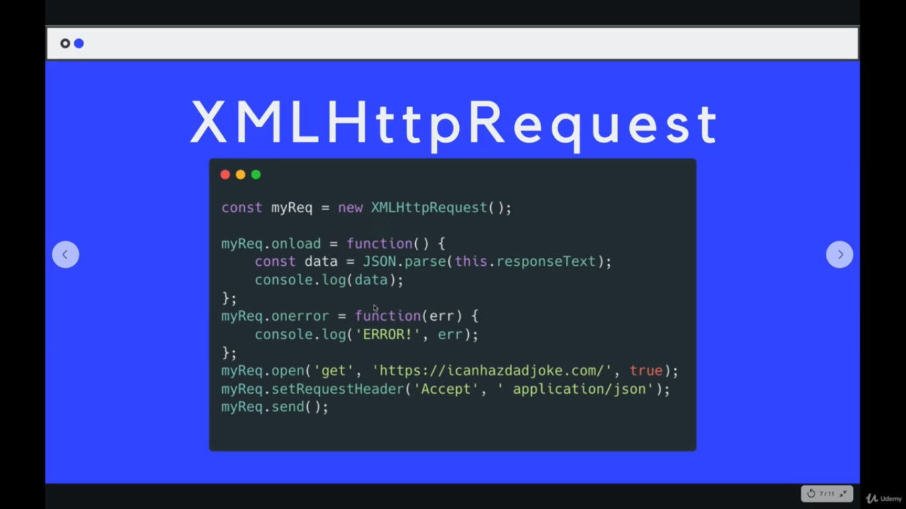

```javascript
//error not working :\ xmlhttprequest is not defined .. will ignore it for now since this is not the way I will usually use

const firstReq = new XMLHttpRequest();

// you can use either onload and onerror or addeventlistner

firstReq.addEventListener('load', function () {
	console.log('it worked');
	const data = JSON.parse(this.responseText); // convert json to javascript
	console.log(data);
});
firstReq.addEventListener('error', function () {
	console.log('ERROR!!!');
});

firstReq.open('GET', 'https://swapi.co/api/planets/'); //set request method and request url
firstReq.send(); //nb: this happen async
console.log('Request Sent!!');

// Access to XMLHttpRequest at 'https://swapi.co/api/planets/' from origin 'null' has been blocked by CORS policy: No 'Access-Control-Allow-Origin' header is present on the requested resource.
```

[Solved using this](https://chrome.google.com/webstore/detail/moesif-origin-cors-change/digfbfaphojjndkpccljibejjbppifbc)

<h4>VERY IMPORTANT NOTE:</h4>
this with arrow functions usually refers to windows object as it refers to the parent of the parent, the parent get inherited through children

<br><br>

### fetch:

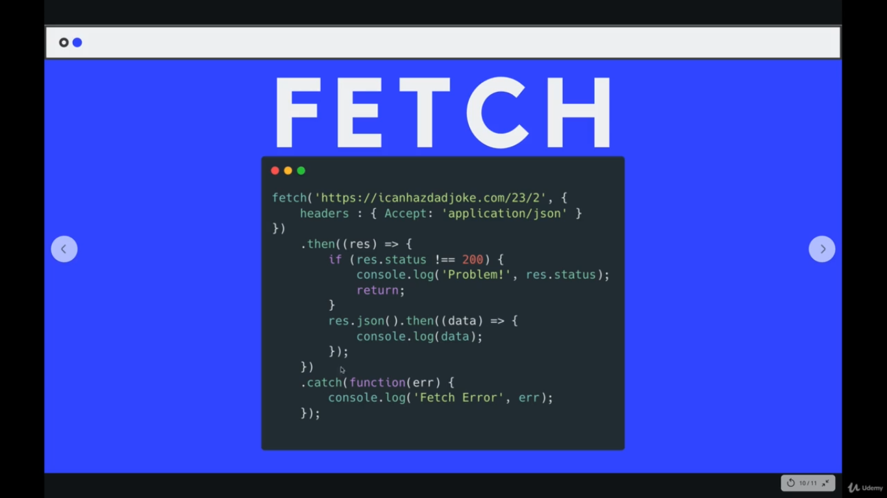

fetch/ promise /xhr return an <mark>object</mark>, you catch this object by setting a parameter in then() and catch()

```javascript
let prom = fetch('https://swapi.dev/api/planets/')
	.then((response) => {
		console.log(
			response.json().then((myObj) => {
				for (const iterator of myObj.results) {
					console.log(iterator.name);
				}
			}),
		);
	})
	.catch((err) => {
		console.log('EEEEERRRRRROOOOOORRRRR');
		console.log('err');
	});

prom;
```

<h5>NB</h5>
The Promise returned from fetch() won’t reject on HTTP error status even if the response is an HTTP 404 or 500. Instead, it will resolve normally (with ok status set to false), and it will only reject on network failure or if anything prevented the request from completing.

```javascript
// in order to solve this we check for the status first
let prom = fetch('https://swapi.dev/api/pzlanets/').then((response) => {
	//this triggers the error change pzlanets in the url to planets
	console.log('received object :', response);
	if (!response.ok) {
		console.log('not status 200', response.status);
		console.log('EEEEERRRRRROOOOOORRRRR');
	} else {
		console.log(
			response.json().then((myObj) => {
				for (const iterator of myObj.results) {
					console.log(iterator.name);
				}
			}),
		);
	}
});
prom;
```

OR

```javascript
let prom = fetch('https://swapi.dev/api/pzlanets/')
	.then((response) => {
		console.log('received object :', response);
		if (!response.ok) {
			throw new Error(`status code: ${response.status}`);
		} else {
			console.log(
				response.json().then((myObj) => {
					for (const iterator of myObj.results) {
						console.log(iterator.name);
					}
				}),
			);
		}
	})
	.catch((err) => {
		console.log('EEEEERRRRRROOOOOORRRRR');
		console.log(err);
	});

prom;

//NB : if you want to trigger the error change the url (/api/planets) not the domain itself (https://swapi.dev)
```

---

```javascript
let prom = fetch('https://swapi.dev/api/planets/')
	.then((response) => {
		console.log('received object :', response);
		if (!response.ok) {
			throw new Error(`status code: ${response.status}`);
		} else {
			return response.json(); //response.json() is a promise
		}
	})
	.then((myObj) => {
		console.log('Fetching all Planets (first 10)');
		console.log(myObj);
		console.log(myObj.results[0].films[0]);
		let movie = myObj.results[0].films[0];
		return fetch(movie);
	})
	.then((response) => {
		console.log('received object :', response);
		if (!response.ok) {
			throw new Error(`status code: ${response.status}`);
		} else {
			return response.json(); //response.json() is a promise
		}
	})
	.then((result) => {
		console.log('Fetching opening crawler from first movie');
		console.log(result.opening_crawl);
	})
	.catch((err) => {
		console.log('EEEEERRRRRROOOOOORRRRR');
		console.log(err);
	});

prom;
```

```javascript
// Refactoring

const checkStatusAndParse = (response) => {
	console.log('received object :', response);
	if (!response.ok) {
		throw new Error(`status code: ${response.status}`);
	} else {
		return response.json();
	}
};
const fetchM = (myObj) => {
	// console.log(myObj.results);
	for (let planet of myObj.results) {
		console.log(planet.name);
	}
	let nextURL = myObj.next;
	return fetch(nextURL);
};

let prom = fetch('https://swapi.dev/api/planets/')
	.then(checkStatusAndParse)
	.then(fetchM)
	.then(checkStatusAndParse)
	.then(fetchM)
	.then(checkStatusAndParse)
	.then(fetchM)
	.then(checkStatusAndParse)
	.then(fetchM)
	.then(checkStatusAndParse)
	.then(fetchM)
	.catch((err) => {
		console.log('EEEEERRRRRROOOOOORRRRR');
		console.log(err);
	});
```

```javascript
// how to make a function retruns a promise
//1

function xyz() {
	// your code here

	const p = new Promise((resolve, reject) => {
		resolve(your - promise - object - here);
	});
	return p;
}

//2

function xyz() {
	// your code here

	return Promise.resolve(your - promise - object - here);
}
```
---
### fetch recap

```js
// fetch is async function which allows us to hit http point and have response returned as a promise

// const promise = fetch('https://jsonplaceholder.typicode.com/todos/1');

let myprom=  fetch('https://reqres.in/api/users')

myprom.then((res) => {
				return res.json(); //take care of this silly mistake cuz it broke the code multiple times before, we use return keyword with arrow function
			})
			.then((data) => console.log(data));
```
```js
// to insert data to api
let myprom = fetch('https://reqres.in/api/users',{
    method: "POST",
    headers: {
        'Content-Type':'application/json'
    },
    body: JSON.stringify({
        name: 'xexo'
    })
}
)

myprom.then((res) => {

    return res.json();
})
    .then((data) => console.log(data));
//{name: "xexo", id: "204", createdAt: "2020-10-21T12:04:45.630Z"} createdAt: "2020-10-21T12:04:45.630Z" id: "204" name: "xexo"
```
---
 ### ajax

```javascript

```

```javascript

```

```javascript

```

```javascript

```

```javascript

```

```javascript

```

```javascript

```

```javascript

```

```javascript

```

```javascript

```

```javascript

```

```javascript

```

```javascript

```

```javascript

```

```javascript

```

```javascript

```


```js
```
```js
```
```js
```
```js
```

---

## Async & Await

### async

```javascript
async function greet() {
	return 'hi';
}
console.log(greet()); // Promise {<fulfilled>: "hi"}
//function preceded with async return a 'resolved' promise

greet().then((data) => console.log(`promise resolved with value ${data}`)); //promise resolved with value hi
```

to create a promise with a rejected value tyou throw an error!!

```javascript
async function add(x, y) {
	if (typeof x !== 'number' || typeof y !== 'number') {
		throw 'X & Y Must be numbers';
	} else {
		return x + y;
	}
}

add('a', 'x')
	.then((val) => {
		console.log(`resolved with ${val}`);
	})
	.catch((err) => {
		console.log(`rejected with ${err}`);
	});
```

```javascript
// same function without async
function add(x, y) {
	return new Promise((resolve, reject) => {
		if (typeof x !== 'number' || typeof y !== 'number') {
			reject('X & Y Must be numbers');
		} else {
			resolve(x + y);
		}
	});
}

add('a', 'x')
	.then((val) => {
		console.log(`resolved with ${val}`);
	})
	.catch((err) => {
		console.log(`rejected with ${err}`);
	});
```

### await

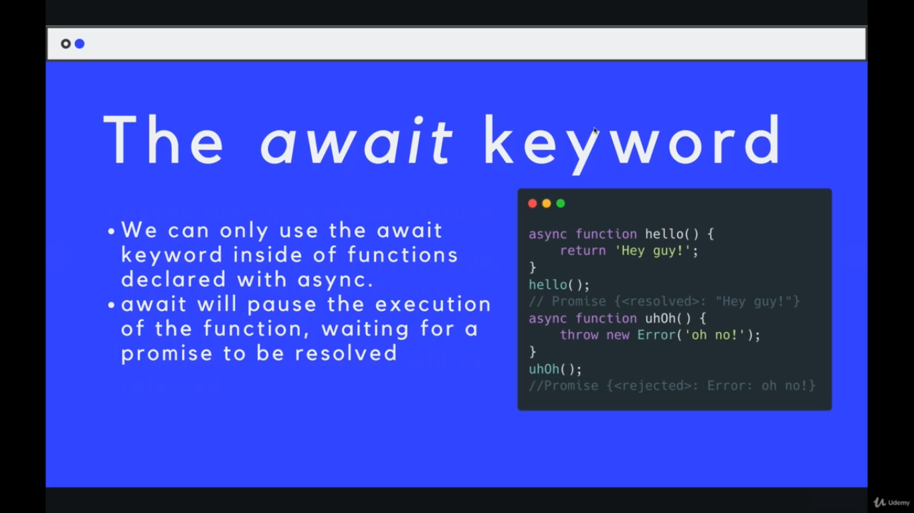

```javascript
// unfortunately not good enough example
function makeRequest(location) {
    return new Promise((resolve, reject) => {
        console.log(`making request to ${location}`);
        if (location == 'google') {
            resolve('google says hi')
        } else {
            reject('we only talk to google')
        }
    })
}

// makeRequest().then((datafromresolve) => {
//     console.log('it worked cuz I'm returning a promise', datafromresolve);
// }).catch((datafromreject) => {
//     console.log('it worked cuz I'm returning a promise', datafromreject);
// })

function processRequest(response) {
    return new Promise((resolve, reject) => {
        console.log(`processing response`);
        resolve(`extra information ${response}`);
    })
}

// makeRequest('google').then((res) => {
//     return processRequest(res)
// }).then((response) => {
//     console.log(response)
// })


async function dowork() { //with async functions you handle errors with try & cat
    try {
        const response = await makeRequest('goooaagle'); //this tells compiler to hold on and don't do anything else before this finish executing
        console.log(response);
        const processReq = await processRequest(response);
        console.log(processReq);
    } catch (err) {
        console.log('error!!',err)
    }
}
dowork()
```

```javascript
//good example
let posts = [
	{ title: 'post1', body: 'this is post1' },
	{ title: 'post2', body: 'this is post2' },
];


function getPosts() {
    setTimeout(() => {
        let outPut = '';
        posts.forEach((post, i) => {
            outPut += `<li>${post.title}</li>`;
        });
        document.body.innerHTML = outPut;
    }, 1000)
}

getPosts()

function createPost(post) {
    setTimeout(() => {
        posts.push(post);
    },2000)
}

createPost({ title: 'post3', body: 'this is post3' });
//the problem here is that once our body is created we can't add more elements into it, notice that adding elements to body takes one second while creating a new element takes two seconds
```

```javascript
//solution 1 using callbacks
let posts = [
	{ title: 'post1', body: 'this is post1' },
	{ title: 'post2', body: 'this is post2' },
];

function getPosts() {
    setTimeout(() => {
        outPut = '';
        posts.forEach((post, i) => {
            outPut += `<li>${post.title}</li>`;
        });
        document.body.innerHTML = outPut;
    }, 1000)
}


function createPost(post,callback) {
    setTimeout(() => {
        posts.push(post);
        callback()
    },2000)
}

createPost({ title: 'post3', body: 'this is post3' }, getPosts);
```

```javascript
//same functionality but with promises

let posts = [
	{ title: 'post1', body: 'this is post1' },
	{ title: 'post2', body: 'this is post2' },
];

function getPosts() {
    setTimeout(() => {
        outPut = '';
        posts.forEach((post, i) => {
            outPut += `<li>${post.title}</li>`;
        });
        document.body.innerHTML = outPut;
    }, 1000)
}


function createPost(post) {
    return new Promise((resolve, reject) => {
        setTimeout(() => {
            posts.push(post);
            const err = false;

            if (!err) {
                resolve();
            } else {
                reject('sth went wrong');
            }

        }, 2000);
    })
}


createPost({ title: 'post3', body: 'this is post3' })
    .then(getPosts)
    .catch(err=>console.log(err))

```

```javascript
//same example with async/await
let posts = [
	{ title: 'post1', body: 'this is post1' },
	{ title: 'post2', body: 'this is post2' },
];

function getPosts() {
    setTimeout(() => {
        outPut = '';
        posts.forEach((post, i) => {
            outPut += `<li>${post.title}</li>`;
        });
        document.body.innerHTML = outPut;
    }, 1000)
}


function createPost(post) {
    return new Promise((resolve, reject) => {
        setTimeout(() => {
            posts.push(post);
            const err = false;

            if (!err) {
                resolve();
            } else {
                reject('sth went wrong');
            }

        }, 2000);
    })
}

async function init(){
    await createPost({ title: 'post3', body: 'this is post3' })
    getPosts()
}

init()

//this way we solved the problem with our first example, if we removed async and await we'll get post1 and post2 only!!

```

---

## Prototypes, Classes, & The New Operator

```javascript

```

```javascript

```

```javascript

```

```javascript

```

```javascript

```

```javascript

```

```javascript

```

```javascript

```

```javascript

```

```javascript

```

```javascript

```

```javascript

```

```javascript

```

```javascript

```

```javascript

```

```javascript

```

```javascript

```

```javascript

```

```javascript

```

```javascript

```

```javascript

```

```javascript

```

```javascript

```

```javascript

```

```javascript

```

```javascript

```

```javascript

```

```javascript

```

```javascript

```

```javascript

```

---

## Module:

import and export statements allows you to break you code in different files and modules

- export : export classes, functions, objects or variables from a file or a module
- import : import classes, functions, objects or variables to your file

<h5>Named Exports</h5>

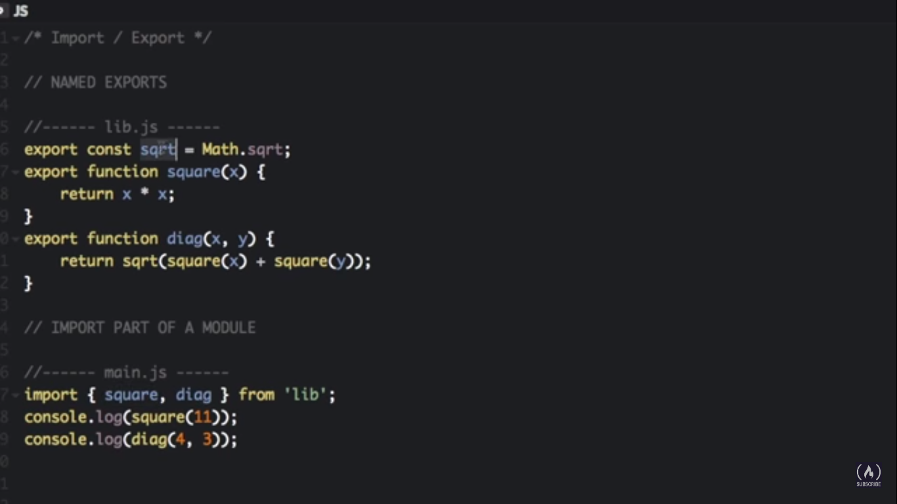

**you import with the same name you exported with!!!, you can give aliases non the less after importing with that very same name**

to import a whole file you use the \* and you call the function by the alias

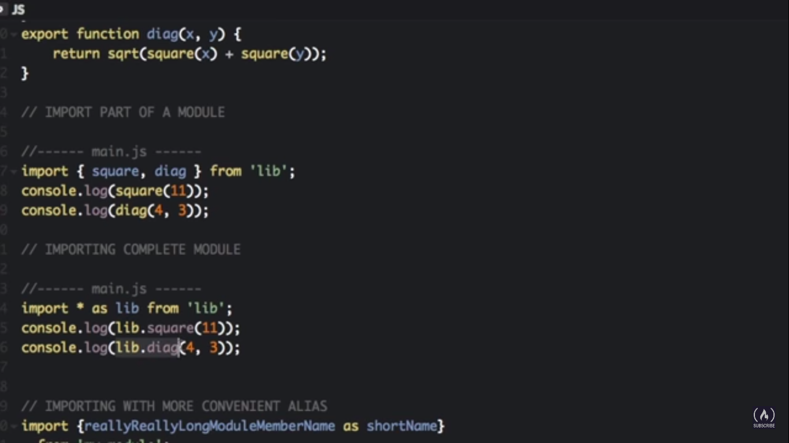

as is used for giving aliases for your file names

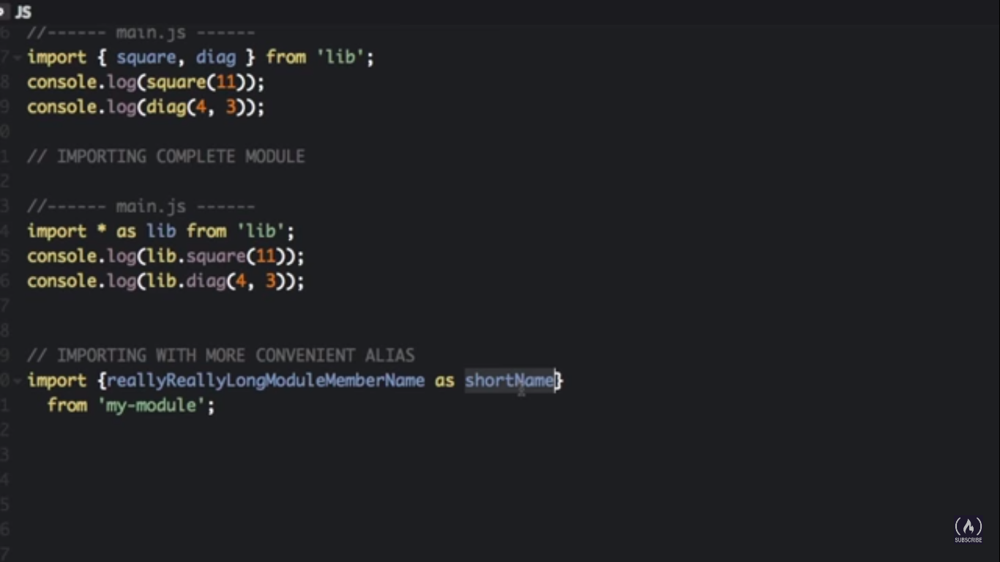

you can only have one default export in your file, when importing the name doesn't need curly braces

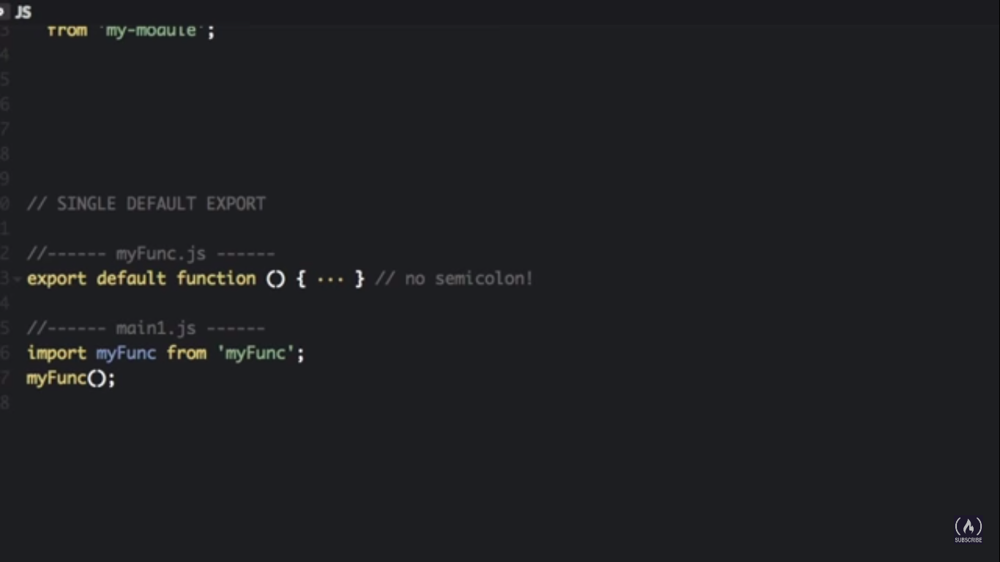

```js
    // you will need this basic structure in your html file
    <script src="es6-module-loader-dev.js"></script>
    <script src="traceur.js"></script>
    <script type="module">
        System.import("./base.js")
    </script>
```

[es6-module-loader-dev.js](es6-module-loader-dev.js)

[traceur.js](traceur.js)

example for multiple export statment
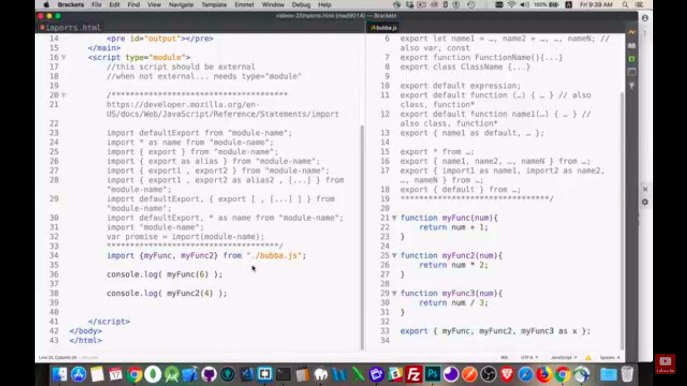
exporting as, same to import as
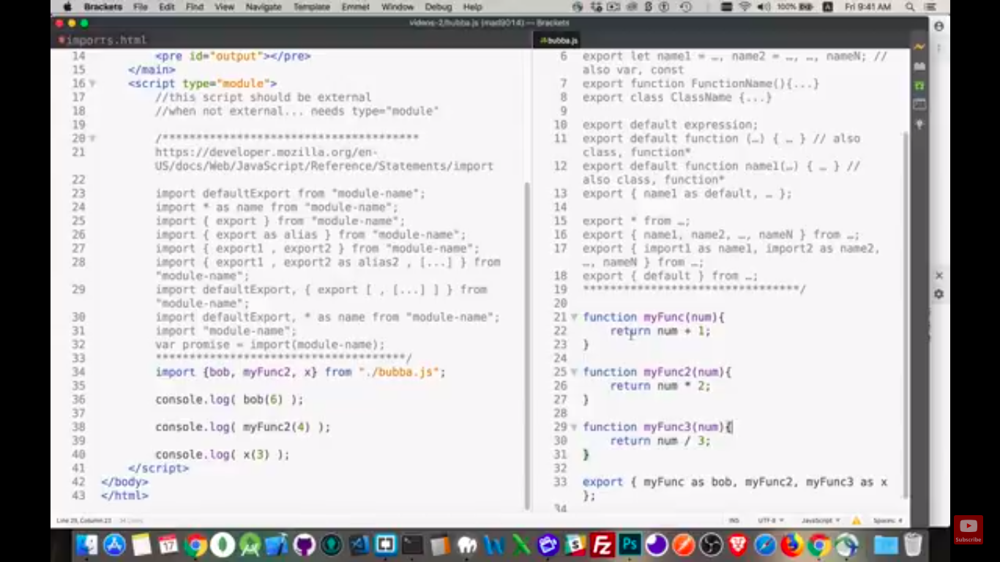
exporting the whole file
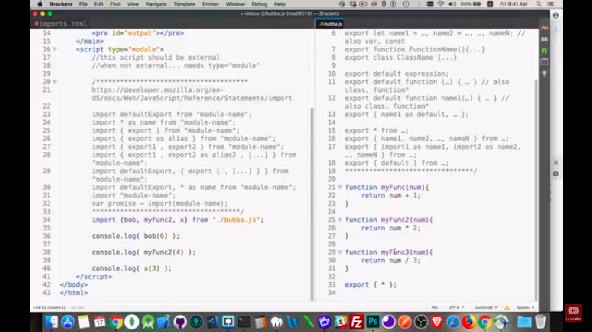
