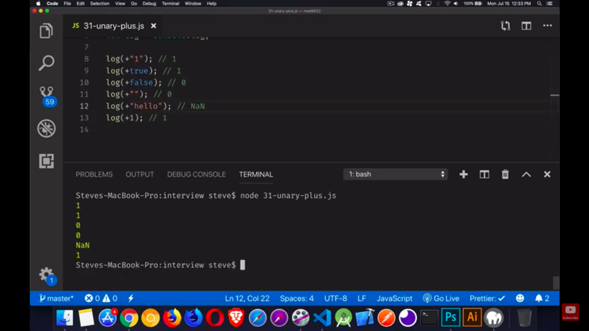

<div align="center">
  
<h1>Javascript</h1>
</div>

<h2>Table of contents<h2>

  - [Introduction](#introduction)
  - [JavaScript Language Basics](#javascript-language-basics)
  - [JS functions](#js-functions)
  - [JS built-in objects](#js-built-in-objects)
  - [error Object](#error-object)
  - [function Object](#function-object)
  - [Browser Object Model (BOM)](#browser-object-model-bom)
  - [Document Object Model (DOM](#document-object-model-dom)
  - [Events](#events)
  - [AJAX & JSON](#ajax--json)
  - [OOP](#oop)

<br>

## Introduction:

```javascript
console.dir() // is the way to see all the properties of a specified JavaScript object
```
You can change the style of the output in the console using <mark>%c</mark>

```javascript
console.log("%c HELLO WORLD","color:blue; background:green"); //blue text with green background
```
___
<br>

## JavaScript Language Basics:
<br>
JavaScript is a loosely typed and dynamic language. Variables in JavaScript are not directly associated with any particular value type, and any variable can be assigned (and re-assigned) values of all types:
<br><br>

```javascript
let foo = 42;    // foo is now a number
foo     = 'bar'; // foo is now a string
foo     = true;  // foo is now a boolean
```
<br>

### Data Types in JS:
<br>

#### Primitive data types::
1. string
2. number
3. boolean
4. undefined
5. bigint
6. symbol
#### Structural Root Primitive::
7. null
#### Non Primitive data types::
8. object
9. function

<br>

##### NB: undefined is the initial value assigned to your variables unless you assign a value yourself
<br>

##### NB:
```javascript
var x;
console.log(typeof x); //undefined

x = null;
console.log(typeof x); //object

x = function () {
    console.log(typeof x);
}
console.log(typeof x); //function

x = {
    b:3,
    a: 5,
}
console.log(typeof x); //object
```
<br>

### Falsy values:
1. zero
2. false
3. null
4. undefined
5. empty string
<br>

<mark>any other value is truthy</mark>

##### NB:
the return statement from && is the value that resulted / not resulted the return value to be <u>false</u> while in case of || is the value that resulted / not resulted the return value to be <u>true</u>


```javascript

console.log(5 && 0); // return 0 ... false
console.log(5 && 2); // return 2 ... true

console.log(5 || 0); // return 5 ... true
console.log(5 || 2); // return 5 ... true

```

##### NB:
since one not(!) returns the opposite boolean value of the variable, double not(!!) or !(!) will return the equivalent boolean value of the variable

```javascript
console.log(!9); //false

console.log(!!9);//true
```
### Coercion
coercion happens when js parser / engine convert a data type from one type to another

```javascript
console.log(5=="5")// returns true as JS converts the numerical 5 to string, it's solved by using strict equality

console.log(3<2<1) //returns true!!.. the parser her converted 3<2 to false and the equation became false < 1 then false is changed into zero so the final equation became 0<1 which returns FALSE ... to solve this problem we use brackets => 3<(2<1) this will returns false
```

#### unary operators

[Operator_Precedence#Associativity](https://developer.mozilla.org/en-US/docs/Web/JavaScript/Reference/Operators/Operator_Precedence#Associativity)
### communicating with user:

```javascript
alert("END IS NEAR!!");
var x=4;
alert("value of x: "+x);

var name= prompt("enter your name","Mr.J"); // in case the prompt showed up and I clicked cancel instead of ok the value of name will be null... the default value

var action= confirm("are you sure?") // action value is either true or false
```
___

## JS functions
<br>

### Built-in functions

```javascript
var x = "abc1001"

var x = 'abc1001';
console.log( parseInt(x)); //Nan

x = '1001abc1001';
console.log(parseInt(x)); //1001

x = '10.01abc1001';
console.log(parseInt(x)); //10

x = '10.01abc1001';
console.log(parseFloat(x)); //10.01

x = '01000';
console.log(parseInt(x, "2")); //8

// we add radix (the second parameter for the parseInt) to the to convert from binary to decimal base

//you can convert from octal to decimal by changing the radix to 8

//you can convert from Hexadecimal to decimal by changing the radix to 16


function div(x) {
  if (isFinite(1000 / x)) {
    return 'Number is NOT Infinity.';
  }
  return 'Number is Infinity!';
}

console.log(div(0));
// expected output: "Number is Infinity!""

console.log(div(1));
// expected output: "Number is NOT Infinity."
```


```javascript
//tricky examples using isFinite() & isNan()


console.log(typeof '4abc');
console.log(typeof 4);

console.log(isFinite('4abc')); //false

console.log(isNaN('4abc')); //true

console.log(isNaN('abc4')); //true

console.log(isFinite('0.4')); //true

console.log(isFinite('4')); //true

console.log(isFinite(4)); //true


console.log(isNaN("125")); //false

console.log(isNaN(125)); //false

//isFinite() returns true only if the input is a number without characters

//isNan() returns true only if the input is included in quotation marks
```

##### NB:

prompt output is always a string value so if you're getting a numerical value you need to covert it use parseInt() or parseFloat()

[octal number system](https://www.tutorialspoint.com/octal-number-system)
<br>

[hexadecimal number system](https://www.tutorialspoint.com/hexadecimal-number-system)


```javascript
//encodeURIComponent() is a used to escape special characters in javascript, while decodeURIComponent() is a return the main strnig back before encoding

// encodes characters such as ?,=,/,&,:
console.log(`?x=${encodeURIComponent('test?')}`);
// expected output: "?x=test%3F"

console.log(`?x=${decodeURIComponent('?x=test%3F')}`);
// expected output: "?x=?x=test?"
```
### functions:

##### NB: if you didn't specify a return statement the function returns undefined

```javascript
var x = 5;
function(){
   var x=8; //overriding a preexisted global variable  is called  shadowing
 //... the rest of your code here
}
```
##### NB: You can define variables <u>without the var keyword</u> inside a function but that results in making your variable <u>Global</u> instead of being local to the function

```javascript
var x = 4;
function dragon() {
    y = 5;
    console.log(x + y);
}
console.log(y); //undefined
dragon(); //9
console.log(y); //5
```
___
<br>

## JS built-in objects

___
<br>

## error Object

___
<br>

## function Object

___
<br>

## Browser Object Model (BOM)

___
<br>

## Document Object Model (DOM

___
<br>

## Events

___
<br>

## AJAX & JSON

___
<br>

## OOP
