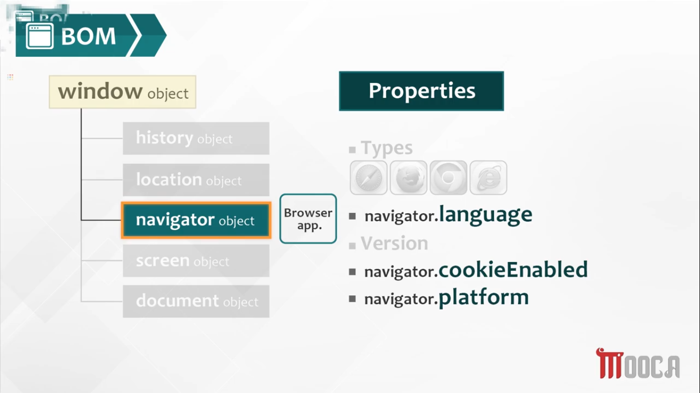

<div align="center">
  
<h1>Javascript</h1>
</div>

<h2>Table of contents<h2>

- [Introduction](#introduction)
- [JavaScript Language Basics](#javascript-language-basics)
- [for-in and for-of](#for-in-and-for-of)
- [Array Metthods](#array-methods)
- [JS functions](#js-functions)
- [JS built-in objects](#js-built-in-objects)
- [error Object](#error-object)
- [object Object](#object-object)
- [function Object](#function-object)
- [Destruction](#destruction)
- [Browser Object Model (BOM)](#browser-object-model-bom)
- [Document Object Model (DOM)](#document-object-model-dom)

<br>

## Introduction

```javascript
console.dir(); // is the way to see all the properties of a specified JavaScript object
```

You can change the style of the output in the console using <mark>%c</mark>

```javascript
console.log('%c HELLO WORLD', 'color:blue; background:green'); //blue text with green background
```

---

<br>

## JavaScript Language Basics

<br>
JavaScript is a loosely typed and dynamic language. Variables in JavaScript are not directly associated with any particular value type, and any variable can be assigned (and re-assigned) values of all types:
<br><br>

```javascript
let foo = 42; // foo is now a number
foo = 'bar'; // foo is now a string
foo = true; // foo is now a boolean
```

<br>

### Data Types in JS

<br>

#### Primitive data types

1. string
2. number
3. boolean
4. undefined
5. bigint
6. symbol

#### Structural Root Primitive

7. null

#### Non Primitive data types

8. object
9. function

<br>

##### NB: undefined is the initial value assigned to your variables unless you assign a value yourself

<br>

##### NB

```javascript
var x;
console.log(typeof x); //undefined


x = null;
console.log(typeof x); //object

x = function () {
 console.log(typeof x);
};
console.log(typeof x); //function

x = {
 b: 3,
 a: 5,
};
console.log(typeof x); //object
```

<br>

### Falsy values

1. zero
2. false
3. null
4. undefined
5. empty string
   <br>

<mark>any other value is truthy</mark>

##### NB

the return statement from && is the value that resulted / not resulted the return value to be <u>false</u> while in case of || is the value that resulted / not resulted the return value to be <u>true</u>

```javascript
console.log(5 && 0); // return 0 ... false
console.log(5 && 2); // return 2 ... true

console.log(5 || 0); // return 5 ... true
console.log(5 || 2); // return 5 ... true
```

##### NB

since one not(!) returns the opposite boolean value of the variable, double not(!!) or !(!) will return the equivalent boolean value of the variable

```javascript
console.log(!9); //false

console.log(!!9); //true
```

### Coercion

coercion happens when js parser / engine convert a data type from one type to another

```javascript
console.log(5 == '5'); // returns true as JS converts the numerical 5 to string, it's solved by using strict equality

console.log(3 < 2 < 1); //returns true!!.. the parser her converted 3<2 to false and the equation became false < 1 then false is changed into zero so the final equation became 0<1 which returns FALSE ... to solve this problem we use brackets => 3<(2<1) this will returns false
```

#### unary operators


<br>

[Operator_Precedence#Associativity](https://developer.mozilla.org/en-US/docs/Web/JavaScript/Reference/Operators/Operator_Precedence#Associativity)

### communicating with user

```javascript
alert('END IS NEAR!!');
var x = 4;
alert('value of x: ' + x);

var name = prompt('enter your name', 'Mr.J'); // in case the prompt showed up and I clicked cancel instead of ok the value of name will be null... the default value

var action = confirm('are you sure?'); // action value is either true or false
```

---

## for in and for of

```js
const array = ['a', 'b', 'c', 'd'];

for (const index in array) {
 console.log(array[index]);
}

// Result: a, b, c, d

for (const item of array) {
 console.log(item);
}
// Result: a, b, c, d
```

|                   | <b>for .. in</b>      | <b>for .. of</b>     |
| ----------------- | --------------------- | -------------------- |
| Applies to        | Enumerable Properties | Iterable Collections |
| Use with Objects? | Yes                   | No                   |
| Use with Arrays?  | Yes, but not advised  | Yes                  |
| Use with Strings? | Yes, but not advised  | Yes                  |

---

> another alternative to iterate over objects is to use `Object.keys()` , `Object.value()` and `Object.entries()`

```js
const testScores = {
 keenan: 80,
 damon: 66,
 shawn: 68,
 marlon: 46,
};

let total = 0;
let scoresArr = Object.values(testScores); //returns an array

for (let score of scoresArr) {
 total += score;
}

console.log(total / scoresArr.length);
```

What does enumerable property mean in JavaScript?

<details><summary><b>Answer</b></summary>

An enumerable property in JavaScript means that a property can be viewed if it is iterated using the for…in loop or Object.keys() method. All the properties which are created by simple assignment or property initializer are enumerable by default.

</details>

[Introduction to JavaScript enumerable properties](https://www.javascripttutorial.net/javascript-enumerable-properties/)

<br>

## Array Methods

what is the difference betwween using foreach vs map?

forEach : accepts callback function. calls the function once per element in the array

```js
let myArr = [1, 2, 3, 4, 5, 6, 7, 8, 9];

let newArr = myArr.forEach(function (n) {
 console.log(n * 2); //2, 4, 6, 8, 10, 12, 14, 16, 18
});
```

map: works the same as foreach but the result of the mapping can be stored into a variable as an array

```js
let myArr = [1, 2, 3, 4, 5, 6, 7, 8, 9];

let newArr = myArr.map(function (n) {
 return n * 2;
});

newArr; //[2, 4, 6, 8, 10, 12, 14, 16, 18]
```

## JS functions

<br>

### Built-in functions

```javascript
var x = 'abc1001';

var x = 'abc1001';
console.log(parseInt(x)); //Nan

x = '1001abc1001';
console.log(parseInt(x)); //1001

x = '10.01abc1001';
console.log(parseInt(x)); //10

x = '10.01abc1001';
console.log(parseFloat(x)); //10.01

x = '01000';
console.log(parseInt(x, '2')); //8

// we add radix (the second parameter for the parseInt) to the to convert from binary to decimal base

//you can convert from octal to decimal by changing the radix to 8

//you can convert from Hexadecimal to decimal by changing the radix to 16

function div(x) {
 if (isFinite(1000 / x)) {
  return 'Number is NOT Infinity.';
 }
 return 'Number is Infinity!';
}

console.log(div(0));
// expected output: "Number is Infinity!""

console.log(div(1));
// expected output: "Number is NOT Infinity."
```

```javascript
//tricky examples using isFinite() & isNan()

console.log(typeof '4abc');
console.log(typeof 4);

console.log(isFinite('4abc')); //false

console.log(isNaN('4abc')); //true

console.log(isNaN('abc4')); //true

console.log(isFinite('0.4')); //true

console.log(isFinite('4')); //true

console.log(isFinite(4)); //true

console.log(isNaN('125')); //false

console.log(isNaN(125)); //false

//isFinite() returns true only if the input is a number without characters

//isNan() returns true only if the input is included in quotation marks
```

##### NB

prompt output is always a string value so if you're getting a numerical value you need to covert it use parseInt() or parseFloat()

[octal number system](https://www.tutorialspoint.com/octal-number-system)
<br>

[hexadecimal number system](https://www.tutorialspoint.com/hexadecimal-number-system)

```javascript
//encodeURIComponent() is a used to escape special characters in javascript, while decodeURIComponent() is a return the main string back before encoding

// encodes characters such as ?,=,/,&,:
console.log(`?x=${encodeURIComponent('test?')}`);
// expected output: "?x=test%3F"

console.log(`?x=${decodeURIComponent('?x=test%3F')}`);
// expected output: "?x=?x=test?"
```

### functions

##### NB: if you didn't specify a return statement the function returns undefined

```javascript
var x = 5;
function(){
   var x=8; //overriding a preexisted global variable  is called  shadowing
 //... the rest of your code here
}
```

##### NB: You can define variables <u>without the var keyword</u> inside a function but that results in making your variable <u>Global</u> instead of being local to the function

```javascript
var x = 4;
function dragon() {
 y = 5;
 console.log(x + y);
}
console.log(y); //undefined
dragon(); //9
console.log(y); //5
```

---

<br>

## JS built-in objects

<br>


### String methods

<br>

> NB: Stings are immutable, ie you can't edit a string once it's declared

```js
let name = Diego;

name[2] = l;

console.log(name); //Output: Diego
```

> NB : you can still edit this variable by overriding the whole string, you're not mutating the string in this case

```js
let name = Diego;
console.log(name); //Output: Diego
name = messi;
console.log(name); //Output: messi
```

> NB: methods have `()` in the end ... a property in the otherhand doesn't

```js
str.length; //this is a property not a method
```

```javascript
var myStr = 'Welcome To Javascript World!!!!!!!!';

console.log(myStr.charAt(myStr.length - 1)); //!

console.log(myStr.indexOf('j')); //-1
console.log(myStr.indexOf('J')); //11
//NB : indexOf() is case sensitive

console.log(myStr.indexOf('script')); //15

console.log(myStr.indexOf('!')); //27
console.log(myStr.lastIndexOf('!')); //34

console.log(myStr.substr(4, 11)); //ome To Java ... return 11 characters starting from character of index 4
console.log(myStr.substring(4, 11)); //ome To ... returns from character of index 4 to character of index 10

console.log(myStr.split(' ')); //[ 'Welcome', 'To', 'Javascript', 'World!!!!!!!!' ]
console.log(myStr.split('')); //[ 'W', 'e', 'l', 'c', 'o', 'm', 'e', ' ', 'T', 'o', ' ', 'J', 'a', 'v', 'a', 's', 'c', 'r', 'i', 'p', 't', ' ', 'W', 'o', 'r', 'l', 'd', '!', '!', '!', '!', '!', '!', '!', '!' ]

console.log(myStr.replace('c', '#')); //Wel#ome To Javascript World!!!!!!!!

console.log(myStr); //Welcome To Javascript World!!!!!!!!
```

##### NB

all these string method don't manipulate the string
<br>ie. these methods return a new output not affecting the value of myStr is the same

<br>

### [Regexp pattern](assets/files/regExp%20pattern.pdf)

How to write a regular expression?
<br> /pattern/flag

<br>

what are the available flags in JS:

- i => ignore case sensitive .. search is case-insensitive: no difference between A and a

- m => multiple lines

- g=> global match .. looks for all matches, without it – only the first match is returned.

- s =>
  Enables “dotall” mode, that allows a dot . to match newline character \n

- u => Enables full unicode support. The flag enables correct processing of surrogate pairs.

- y => “Sticky” mode: searching at the exact position in the text


<br>

### Array

<br>

> we use `const` when declaring an array as they stored as reference and should not be redeclared which is `const` job ... <q>if the shell remains the same, contents can change</q> ... this is the array rule

making a copy of an array

```js
let arr1 = [1,2,3];
let arr2 = [1,2,3];

console.log(arr1===arr2); //false as each array has a different reference

----------

let copyArr = arr1;

console.log(arr1===copyArr); //true as both array has the same referebce in the memory, mutating one of them will result in the mutation of the other for example

copyArr.push(44);

console.log(arr1) ; //output: [1,2,3,44]

```

#### Array Functions

<br>

```javascript
var myArr = [1, 2, 3, 5, 10, 11, 7, 26];

//converts an array to string
console.log(myArr.join('')); //12351011726

console.log(myArr.join()); //1,2,3,5,10,11,7,26

console.log(myArr.join('*')); //1*2*3*5*10*11*7*26

console.log(myArr); //[ 1, 2, 3, 5, 10, 11, 7, 26 ]

console.log(myArr.reverse()); //[ 26, 7, 11, 10, 5, 3, 2, 1 ]

console.log(myArr); //[ 26, 7, 11, 10, 5, 3, 2, 1 ]

console.log(myArr.sort()); //[ 1, 10, 11, 2, 26, 3, 5, 7 ]

console.log(
 myArr.sort(function (a, b) {
  return a - b; //[ 1, 2, 3, 5, 7, 10, 11, 26 ]
 }),
);

console.log(myArr); //[ 1, 2, 3, 5, 7, 10, 11, 26 ]
```

##### NB

- join() didn't affect my main array's value!
- reverse() & sort affected my main array's value!

<br>

#### Associative Array

<br>

- Arrays with named indexes / user defined keys (where the keys is string) are called associative arrays (or hashes).

- JavaScript does not support arrays with named indexes / user defined keys.

- In JavaScript, arrays always use numbered indexes.

<br>

##### NB

you can't use array properties/methods ir the regular for loop with associative arrays as they are basically objects in JavaScript, not a real array.

<br>

```javascript
var associativeArr = new Array();

var x = 'first value';
associativeArr[x] = 1000;
associativeArr['new elem'] = 'abc';
associativeArr['username'] = 'ali';
associativeArr['user age'] = 22;
associativeArr['user skill'] = ['swim', 'dance', 'read', 'play'];

console.log(associativeArr.length); //0
console.log(associativeArr.join()); //empty string

for (let i = 0; i < associativeArr.length; i++) {
 //not working as there's no array to iterate through
 console.log(associativeArr[i]);
}

//the methods above would have worked if the values were stored by the index (0,1,2 ...) not the key value pair like we did

for (const key in associativeArr) {
 console.log(key + ' : ' + associativeArr[key]);
}
//first value : 1000 ​​​​​at ​​​key + ' : ' + associativeArr[key]​

//new elem : abc ​​​​​at ​​​key + ' : ' + associativeArr[key]​​​

//username : ali ​​​​​at ​​​key + ' : ' + associativeArr[key]​​​

//user age : 22 ​​​​​at ​​​key + ' : ' + associativeArr[key]​​​
//user skill : swim,dance,read,play
```

### Date


```javascript
var today = new Date();

console.log(today); //Mon Sep 21 2020 06:58:19 GMT+0200 (Eastern European Standard Time)

console.log(today.getDate()); //21

console.log(today.getDay()); //1

console.log(today.getMonth()); //8

console.log(today.getYear()); //120

console.log(today.getFullYear()); //2020

console.log(today.setDate(15)); //output is the equivalent in milliseconds ...1600145930957

console.log(today); //Tue Sep 15 2020 06:59:51 GMT+0200 (Eastern European Standard Time)

console.log(today.setMonth(1)); //output is the equivalent in milliseconds ... 1581742830840

console.log(today); //Sat Feb 15 2020 07:00:45 GMT+0200 (Eastern European Standard Time)

console.log(today.toDateString()); //Sat Feb 15 2020

console.log(today.toLocaleString()); //2/15/2020, 7:01:15 AM

//toDateString() & toLocaleString() don't affect the format of my today object
console.log(today); //Sat Feb 15 2020 07:01:32 GMT+0200 (Eastern European Standard Time)
```

---

<br>

## error Object

<br>

1. syntax error
2. type error
3. range error
4. reference error
5. eval error
6. URI error

### SyntaxError : error when trying to interpret syntactically invalid code

```javascript
alert("hello"; //syntaxError
```

<br>

### TypeError : represents an error when an operation could not be performed, typically (but not exclusively) when a value is not of the expected type. It may be thrown when

<br>

- an operand or argument passed to a function is incompatible with the type expected by that operator or function; or
- when attempting to modify a value that cannot be changed; or
- when attempting to use a value in an inappropriate way.53

```javascript
console.log('hello'); //type error, console.log is not a function
```

<br>

### RangeError : when a value is not in the set or range of allowed values

```javascript
console.log((123.456).toFixed(2)); //123.46
console.log((123.456).toFixed(101)); //RangeError: toFixed() digits argument must be between 0 and 100

/**
 * toFixed() method formats a number using fixed-point notation
 * 1 => to the nearest units digit
 * 2 => to the nearest tenth digit
 * 3 => to the nearest hundredth digit
 **/
```

```javascript
var myError = new Error('custom err0r');

var result = parseInt(prompt('enter a value between 10 and 20', '15'));

if (result > 20) {
 throw myError;
} else if (result < 10) {
 throw new RangeError('Out of range');
} else {
 alert('with in accepted range');
}
```

```javascript
//error properties

console.log(myError.name); //Error
console.log(myError.message); //custom err0r
```

<br>

#### error handling

1. try ... catch

2. onerror event handler: the old standard solution, used to retrieve additional information about error and suppress error in the console

1- try and catch :

if the try block <u>throws</u> an error will move directly to the catch block and ignore the rest of the code inside the try block... similarly if the catch block <u>throws</u> an error will ignore it and go to the finally block

  <br>

```javascript
var result = parseInt(prompt('enter a value between 10 and 20', '15'));

try {
 if (result > 20) throw 'error!!!';
 else if (result < 10) throw new RangeError('Out of range');
 else console.log('with in accepted range');

 console.log('logging form the try block');
} catch (e) {
 console.log('logging from the catch block');
}
console.log('done');

/***
 * prompt<== 15
 * output:
 * with in accepted range
 * logging form the try block
 * done
 *
 ** prompt<== 55
 * output:
 ** logging from the catch block
 ** done
 ***/
```

```javascript
var result = parseInt(prompt('enter a value between 10 and 20', '15'));

try {
 if (result > 20) throw 'error!!!';
 else if (result < 10) throw new RangeError('Out of range');
 else console.log('with in accepted range');

 console.log('logging form the try block');
} catch (e) {
 console.log('catch error occurred'); //typeError here will prevent the execution of the catch block
 console.log('logging from the catch block');
} finally {
 console.log('done');
}
/**
 *prompt<== 55
 * output:
 * done
 *
 * NB: if there's no finally block and the code was the same, the rest of the code wouldn't have been executed as the error in the catch would stop the execution of the rest of my code
 */
```

```javascript
var result = parseInt(prompt('enter a value between 10 and 20', '15'));

try {
 if (result > 20) throw 'error!!!';
 else if (result < 10) throw new RangeError('Out of range');
 else console.log('with in accepted range');

 console.log('logging form the try block');
} catch (e) {
 if (e instanceof RangeError) {
  console.log('this is a range error msg');
  console.log(e.name);
  console.log(e.message);
 } else if (e === 'error!!!') {
  console.log('this is too much, man!');
 }

 console.log('logging from the catch block');
} finally {
 console.log('done');
}

console.log('logging from after the finally block'); // will be displayed if there's no error in the catch block or the finally block

/**
 * prompt<== 55
 * this is too much, man!
 * logging from the catch block
 * done
 * logging from after the finally block
 */
```

2- onerror event :

```javascript
window.onerror = errorHandle;

function errorHandle(msg, url, l, col, err) {
 document.write('msg : ' + msg);
 document.write('<br>');
 document.write('url : ' + url);
 document.write('<br>');
 document.write('l : ' + l);
 document.write('<br>');
 document.write('col : ' + col);
 document.write('<br>');
 document.write('err : ' + err);

 return true; //will not show the error in the console
 //return false will show the error in the console
}

var result = parseInt(prompt('enter a value between 10 and 20', '15'));

if (result > 20) throw 'error!!!';
else if (result < 10) throw new RangeError('Out of range');
else console.log('with in accepted range');

console.log('logging form the try block');

console.log('done');

/**
 * prompt<== 8
 * msg : Uncaught RangeError: Out of range
 * url : pen.js
 * l : 26
 * col : 7
 * err : RangeError: Out of range
 */
```

<br>

### ReferenceError :invalid reference used, raised when referring to a variable that doesn't exist in the scope

<br>

### EvalError : raised by eval when used incorrectly

<br>

### URIError : raised when encodeURI() or decodeURI() are used incorrectly

---

<br>

## object Object

<br>

accessing data inside an object

```js
//example 1

const obj = {
 1999: 'good',
 2020: 'bad',
};
```

you can only access the values inside the object using either bracket or dot notation but in this case the usual dot notation won't work and you need to use bracket notation!!

```js
console.log(obj.2020) //returns error
console.log(obj[2020]) //returns bad

```

> NB: they key you use in the bracket notation MUST be a string, only in the case above where we use a number not a text, it coerc it to a string

```js
//example 2

const obj2 = {
 good: '1887',
 bad: '1991',
};

console.log(obj2[good]); //returns error
console.log(obj2['good']); //returns "1887"
```

### Custom Function

#### function statement vs function expression

```javascript
//function statement ... Hoisted (can be called before it's declaration)

function sum(a, b) {
 return a + b;
}
//function expression  ... Not Hoisted (Has to be called after declaration)

//part after the equal sign is called anonymous function or literal function

var myFun = function (a, b) {
 return a + b;
};
```

#### Assign a function to array

```javascript
var myArr = [
 1,
 2,
 3,
 function (a, b) {
  return a + b;
 },
 5,
];

//call function
var summation = myArr[3];
summation(2, 2); //4
//or
myArr[3](2, 2); //4
```

#### return function from function

```javascript
function newAddingFunction(x, y, z) {
 return function () {
  return x + y + z;
 };
}

var result = newAddingFunction(1, 2, 3);
console.log(result());
```

### Custom Object

#### you can create an object using

1. constructor
2. literal way
   

#### adding properties to object with dot notation and subscript notation


```javascript
var myCustObj = {
 name: 'abbas el mehtas',
 age: 21,
 info: function () {
  return 'my name is ' + this.name + " I'm " + this.age + ' years old.'; //this refers to the calling object
 },
};

console.log(myCustObj.info()); //my name is abbas el mehtas I'm 21 years old.
```

Q: How can you create multiple object having the same properties
A: we can either use factory method or a constructor

```javascript
//factory method

function employee(nm, dept, sal) {
 return {
  name: nm,
  department: dept,
  salary: sal,
  info: function () {
   return this.name + '  works in the ' + this.department + ' department';
  },
 };
}

var emp1 = employee('ahmed', 'mearn', 2200);
console.log(emp1.info()); //ahmed  works in the mearn department

//constructor method

function Employee(name, department, salary) {
 //defining properties for the "caller object" ==> this

 this.empName = name;
 this.empDep = department;
 this.empSalary = salary;
}

var emp2 = new Employee('Aizen', '13', 13113);
console.log(emp2); //Employee { empName: 'Aizen', empDep: '13', empSalary: 13113 }
console.log(emp2['empName']);
```

### the keyword This

`this` referes to it's caller / whaterver is on the left of it's invoker (before the dot)

```js
const cat = {
 name: 'tom',
 color: 'blue',
 meow() {
  console.log(`${this.name} says MEOWWW`);
 },
};

cat.meow(); //tom says MEOWWW
```

```js
const cat2 = cat.meow;

cat2(); //says MEOWWW
```

so what happened here?

in the first example this refers to the caller `cat.meow()` who called meow?
the cat!! (what is on the left of the dot) thus we got tom's name
but in the second example the caller is actually the window object
what's on the left of the caller? who called our method to begin with ?
it is `cat2()` who's on the left? nothing? it's the window as the window is the parent object of everything in our website

<strong> This and arrow function</strong>

```js
const person = {
 firstNName: 'Viggo',
 lastName: 'Mortebsen',

 fullName: function () {
  return `${this.firstName} ${this.lastName}`;
 },
};

console.log(person.fullname()); // Viggo Mortebsen
```

```js
const person = {
 firstNName: 'Viggo',
 lastName: 'Mortebsen',

 fullName: () => {
  return `${this.firstName} ${this.lastName}`;
 },
};

console.log(person.fullname()); // undefined undefined
```

in the first example the word `this` referes to the object .

in the second example `this` referes to the window object, that's the usual case with arrow function where it's doesn't care for who called it but for the scope it was called in and since the person object is in the wwindow scope so this refers to the window

```js
const person = {
 firstNName: 'viggo',
 lastName: 'Mortebsen',

 fullName: function () {
  console.log(this);
  return `${this.firstName} ${this.lastName}`;
 },

 shoutName: function () {
  setTimeout(function () {
   console.log(this);
   console.log(this.fullName());
  }, 3000);
 },
};

console.log(person.shoutName()); //this.fullName is NOT defined
/*

this output happened because the keyword this in this context refers to the caller which is setTimeout, the function setTimeout belongs to the window object (window.setTimeout() and that's why it returned not defined)
*/
```

<mark>
 One way where arrow function can be of use with the word `this` is inside a 1-level nested function where the value of this will refers to the object since the scope the outer function wwas created in is that of the object
</mark>

<div style="text-align: right;">
<p >

`this` بيخلي arrow functionيعني من الاخر بالبلدي كده ال
بدل ما تبقي بتشاور علي مين اللي ندهها بقت بتشاور علي هي مندوهه فين

</p>

</div>

```js
const person = {
 firstNName: 'viggo',
 lastName: 'Mortebsen',

 fullName: function () {
  console.log(this);
  return `${this.firstName} ${this.lastName}`;
 },

 shoutName: function () {
  setTimeout(() => {
   console.log(this);
   console.log(this.fullName());
  }, 3000);
 },
};

console.log(person.shoutName()); // Viggo Mortebsen
```

### object methods

```javascript
//instant methods
console.log(emp2.hasOwnProperty('empName')); //true
console.log(emp2.hasOwnProperty('empname')); //false
console.log(emp2.toString()); //[object Object] .... this is the string representation of objects, its telling me it's an object from  the parent Object and It inherit from it all it's properties, hence toString()

//static functions (Class Methods)
console.log(Object.keys(emp2)); // [ 'empName', 'empDep', 'empSalary' ]
console.log(Object.values(emp2)); // [ 'Aizen', '13', 13113 ]

//delete property from object

delete emp2.empName;

console.log(emp2); //Employee { empDep: '13', empSalary: 13113 }

for (const key in emp2) {
 console.log(key + ' : ' + emp2[key]);
}
//empDep : 13
//empSalary : 13113
```

Q: what is the difference between instance method and static method ?

A: Instance method are methods which require an object of its class to be created before it can be called. Static methods are the methods in Java that can be called without creating an object of class.

### data descriptor

data descriptor means :

- to prevent <u>loop</u> over the object and it properties
- to prevent <u>deleting</u> the object properties
- to prevent <u>changing the value</u> specified with a key once it's initiated ...ie property's value can't be changed

<br>

data descriptor default values:

value: undefined;

writable:false;

configurable:false

enumerable:false

##### NB : these values are added implicitly after I define my objName and PropName

```javascript
/*

//static method:

Object.defineProperty(objName,propName,{
    accessor descriptor or  data descriptor
}
})
*/

var name = 'ali';
var age = 25;
var address = '5 sesame st. ';

var obj = {};

Object.defineProperty(obj, 'name', {
 value: name,

 writable: false, // cant change it's value once defined

 configurable: false, // cant delete the value specified to my propName

 enumerable: false, // can't loop over properties in the object
});

console.log(obj.name); //ali

obj.name = 'zidan';

console.log(obj.name); //ali ... even if i didn't write 'writable: false' the value would have still been ali as it's the default value, in order to change the value writable should be true

delete obj.name;

console.log(obj.name); //ali

for (const key in obj) {
 console.log(i + ':' + obj[key]); // NO OUTPUT, doesn't log anything as I've prevented looping over this object
}

//to define multiple properties

Object.defineProperties(obj, {
 age: {
  value: age,
  writable: true,
  configurable: false,
  enumerable: false,
 },
 addr: {
  value: address,
  writable: true,
  configurable: false,
  enumerable: false,
 },
});

obj.age = 23;
console.log(obj.age); //23
delete obj.addr;
console.log(obj.addr); //5 sesame st.
```

### accessor descriptor

```javascript
var department = 'SD';

Object.defineProperties(obj, {
 department: {
  get: function () {
   //can remove it if I don't want the department value to be accessible  and know it's value
   return department;
  },
  set: function (val) {
   //can remove it if I don't want the department value to be editable
   department = val;
  },
 },
 display: {
  // set: function (val) {
  //     display = val;
  // },
  get: function () {
   return (
    'this is a display method...' +
    ' my department is ' +
    this.department +
    ' my name is ' +
    this.name
   );
  },
 },
});
console.log(obj.department); //SD
obj.department = 'SA';
console.log(obj.department); //SA .. if there was no set property the value would have stayed the same

var displayOutput = obj.display;
console.log(displayOutput); //this is a display method... my department is SA my name is ali
```


---

<br>

## function Object

<br>


```javascript
//IIFE => Immediate invoke function expression
//ex:
(function (a, b) {
 return a + b;
})();
```

### function object property

```javascript
function sum() {
 var total = 0;
 console.log(arguments.length);
 for (var index in arguments) {
  total += arguments[index];
 }
 return total;
}

console.log(sum(1, 2, 3, 4, 5, 6)); //21
```

### function object method

```javascript
//function borrow using apply .. this will make able to use .join() on the string!!

var arr = [];
var str = 'Hello Javascript';

console.log(arr.join.apply(str, ['**'])); //H**e**l**l**o** **J**a**v**a**s**c**r**i**p**t
console.log([].join.apply(str, [,])); //H,e,l,l,o, ,J,a,v,a,s,c,r,i,p,t

//function borrow using call

console.log(arr.join.call(str, '-')); //H-e-l-l-o- -J-a-v-a-s-c-r-i-p-t .. could have been written [].join.call as well

//binding .. the pro of using binding method is that I can define how I'm joining my string in the return statement so I can return different forms for the same string

//NB if you defined how you're binding in the declaration it will ignore  what you're using to bind when using the  literal function

var res = [].join.bind(str, '-*');
console.log(res()); //H-*e-*l-*l-*o-* -*J-*a-*v-*a-*s-*c-*r-*i-*p-*t

var res2 = [].join.bind(str);
console.log(res2('-*-')); //H-*e-*l-*l-*o-* -*J-*a-*v-*a-*s-*c-*r-*i-*p-*t

var res3 = [].join.bind(str, '-*');
console.log(res('--')); //H-*e-*l-*l-*o-* -*J-*a-*v-*a-*s-*c-*r-*i-*p-*t
```

#### shadowing concept

```javascript
var a = 7;

function foo() {
 var a = 45; // this is called shadowing as I created a variable with the same name inside the function as the global variable
}
```

#### closure

closure means variable that are inherited in my local scope from the outer scope


NB: I've a variable a sent already in my innerFun/result that why I ignored the value of a from the closure


#### IIFE Pattern

```javascript
function outerFun() {
 var arr = [];
 for (var i = 0; i < 3; i++) {
  arr.push(function () {
   console.log(i); //return 3 3 3
  });
 }
 return arr;
}

var result = outerFun();
console.log(result[0]());
console.log(result[1]());
console.log(result[2]());
//explanation : the return is 3 each time as it doesn't have value for i so it get the value from the outer scope after the loop is done
```

```javascript
function outerFun() {
 var arr = [];

 for (var i = 0; i < 3; i++) {
  arr.push(
   (function (j) {
    return function () {
     console.log(j); //0,1,2
    };
   })(i),
  );
 }

 return arr;
}

var result = outerFun();
console.log(result[0]());
console.log(result[1]());
console.log(result[2]());

//explanation the is a pattern for a well known problem, here I've made the variable i appear in my local scope by sending it each time using the immediate invoke, I separated the scopes of the two function to avoid the problem from the previous solution where I was getting the value of i after the loop is already done
```

---

## Destruction

### param destruction

```js
const person = {
 firstName: 'jon',
 lastName: 'snow',
};

function fullname(user) {
 return `${user.firstName} ${user.lastName}`;
}

fullname(person); //jon snow
```

```js
function fullname({ firstName, lastName }) {
 return `${firstName} ${lastName}`;
}

fullname(person); //jon snow
```

```js
const seriesArr = [
 {
  title: `queen's bandit`,
  score: 8
 },{
  title: `the office`,
  score: 9
 },{
  title: `death note`,
  score: 9.5
 }
]


//const filterRes = seriesArr.filter(series=>series.score>=9)

const filterRes = seriesArr.filter({score}=>score>=9)

```

<br>
___
<br>

## Browser Object Model (BOM)

<br>

- window object //parent object
  - history object //sibling
  - location object //sibling
  - navigation object //sibling
  - screen object //sibling
  - document object //sibling => DOM


win.focus() is used to keep the new created window in focus when clicking on the buttons


move by will keep moving the window indefinitely,
move to will keep moving the window to a fixed position

same goes to resize to and by & scroll to and by

### setTimeOut() vs setInterval()

setTimeOut()=>works once after some time

setInterval() =>works indefinitely


you usually won't need stopTimeout but in this example I've forced myself into a loop so I needed to use it

### history object

it refers to the history of the current tab not the browsers history


##### NB :8

history.go() accepts +ve and -ve values

### location


```javascript
location.replace('your-url-here'); // won't affect your history (can still move forward and backward)or history.length .. you're replacing one page with the other

location.assign('your-url-here'); //won't be able to move forward

location.reload(); //refresh my page
```


### Navigator




.appCodeName is a misleading property, it'll always return Mozilla, use userAgent instead

---

<br>

## Document Object Model (DOM)

<br>

- what is the difference between `textContent`, `innerText` and `innerHTML`?

<details><summary><b>Answer</b></summary>

```html
<div id='blog test'>

This element is <strong>strong</strong> and     has some super fun <code>code</code>!
</div>
const getValue = document.getElementById('blog-test');
```

Here’s what innerHTML, innerText, and textContent return:

```javascript
getValue.innerHTML

//This element is <strong>strong</strong> and has    some super fun <code>code</code>!

getValue.innerText

//This element is strong and has some super fun code!

getValue.textContent
//This element is strong and     has some super fun code!
```

- `innerText` doesn't return the original content but returns the result you see on the screen ie. if some text is hidden inside a div and we used `innerText` on it, the hidden div won't be returned back

- this is not the case with `textContent` where it returns the whole text even the one that was modified with css

- when u want to change value of some container with plain text `textContent` and `innerText` will work for u but if u wanted to use html then `innerHTML` is the one for u

</details>

<br>

- How to set & retrieve styles form an element with Javascript?

<details><summary><b>Answer</b></summary>

- to set styles on an element you select the element and use `.style.propertyName = "value here"` .... on the other hand, selecting an element and using `.style` on it doesn't work when retrieving css as it only retrieves the <u>inline style</u>

- in order to get all the styles on an element you can use `window.getComputedStyle(YourSelectedElementGoesHere).propertyName`

</details>

- `perviousSibling` , `perviousElementSibling`, `nextSibling` & `nextElementSibling` what is the difference between these four?

<details><summary><b>Answer</b></summary>

- `perviousSibling` , `nextSibling` return the corresponding node from the node tree and everything is represented as a node in the node tree so usually `perviousSibling` , `nextSibling` returns `#text` representing empty node or white space

- `perviousElementSibling`, `nextElementSibling` returns the acctual elements

</details>

- `appendChild()`, `append()`, `perpend()` & `insertAdjacentElement()`

<details><summary><b>Answer</b></summary>

- `appendChild()`, `append()`, `perpend()` add elements as children before and after elements with `append()` & `perpend()` able to add more than one child at once

- `insertAdjacentElement(position,element)` add elemnt adjacent to other element not as a child, it takes position values like
  - <mark>
    `beforebegin` : before element
  </mark>

  - `afterbegin`: inside element before first child
  - `beforeend` : inside element after last child

  - <mark>
    `afterend` : after element
  </mark>

</details>
