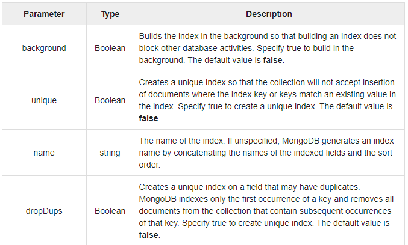
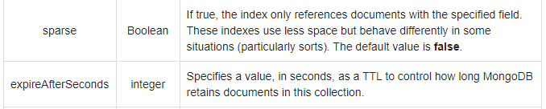
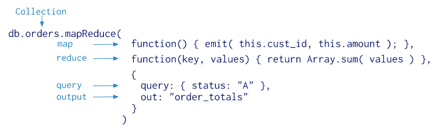
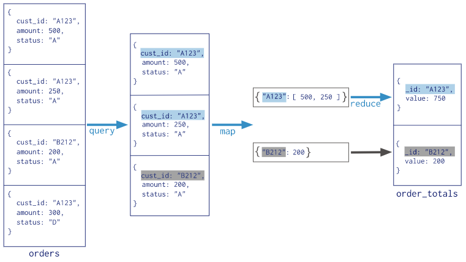
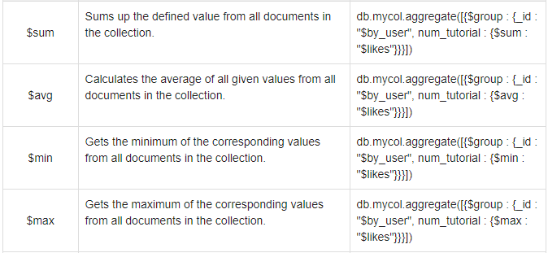
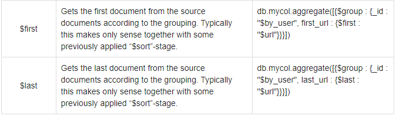

<div align="center">
  
<h1>Mongo</h1>
</div>

<h2>Table of contents<h2>

- [Indexing](#indexing)
- [MapReduce](#MapReduce)
- [Aggregate](#Aggregate)
- [Relationship](#Relationship)
---

1. right click the server icon
2. create database

```json
library
```
3. open collections
4. create collection
```json
books
```
5.create some documents
```json
{
    "ISBN" : 123.0,
    "Title" : "C#",
    "Pages" : 200.0,
    "Subject" : "Programming"
}
```
```json
{
    "ISBN" : 234.0,
    "Title" : "js",
    "Pages" : 50.0,
    "Subject" : "Front-end"
}
```
```json
{
    "ISBN" : 345.0,
    "Title" : "HTML",
    "Pages" : 100.0,
    "Subject" : "Programming"
}
```


## Indexing

To create an index you need to use ensureIndex() method of
MongoDB.

```
    db.____.ensureIndex({the-columns-that-I want})

    db.Books.ensureIndex({"Pages":1})
```
if the output is ok 1.0 then it was done successfully, if not it will return an error

when you open the indexes folder in your collection you will find _id there by default, it is there as by default your documents are sorted by id

but how can we create an index??



to see whether or not your queries are using an index,

```json
db._____.find().explain()

//use queryPlanner>>winningPlan>>inputStage>>indexName to know which index was used for finding the data
```

* by default the name is the column name and 1 if we are sorting in ascending order and -1 if we are sorting in descending order

* dropDups: true >>>> if a value is repeated in a field between multiple documents and dropDups is true , it will return the first repeated value
3 books with 50 pages will return the first book from those 3 books

* sparse solves the issue with find in the CLI where when I was looking up books with number of pages that is not equal to a certain number it was returning books with no pages property as well


 <details>
  <summary><mark>Ok that's all good but why should I use ensureIndex? what does it do to help us?</mark></summary>
  <p>ensureIndex gives us an extra index beside our default _id so we can find stuff faster (specially with very large databases) than the regular way using the id where it goes through our database record by record, u use ensureIndex on records the user mostly will search with the most</p>
</details>

```json
db.Books.ensureIndex({"Pages":1}) //this line will adds  an index file in my indexes folder called Pages_1 which willl make the searching process faster when searching for books

//NB: 1 sort the pages in ascending order
```


---

## MapReduce

```
{
    "Name" : "STD01",
    "Stage" : 1,
    "Grades" : [
        {
            "Course" : "c01",
            "Grade" : 100
        },
        {
            "Course" : "c02",
            "Grade" : 95
        },
        {
            "Course" : "c03",
            "Grade" : 80
        }
    ],
    "Age" : 22
}
```

```
{
    "Name" : "STD02",
    "Stage" : 1,
    "Grades" : [
        {
            "Course" : "c01",
            "Grade" : 80
        },
        {
            "Course" : "c02",
            "Grade" : 85
        },
        {
            "Course" : "c03",
            "Grade" : 90
        }
    ],
    "Age" : 20
}
```

```
{
    "Name" : "STD03",
    "Stage" : 2,
    "Grades" : [
        {
            "Course" : "c01",
            "Grade" : 40
        },
        {
            "Course" : "c02",
            "Grade" : 65
        },
        {
            "Course" : "c03",
            "Grade" : 90
        }
    ],
    "Age" : 27
}
```

```
{
    "Name" : "STD04",
    "Stage" : 2,
    "Grades" : [
        {
            "Course" : "c01",
            "Grade" : 86
        },
        {
            "Course" : "c02",
            "Grade" : 99
        },
        {
            "Course" : "c03",
            "Grade" : 88
        }
    ],
    "Age" : 15
}
```

Map-reduce is a data processing paradigm for condensing large
volumes of data into useful aggregated results. MongoDB provides
the mapReduce database command.




1 - first thing mapreduce look for is the query, this defines what the map reduce should work with else it will work with all your data

2 - it goes for the map function parameters the first is what you choose/reduce with the second param is what the mathematical operation will be on

3.those param got passed down to the second function which does the actual work and return you the ***new output collection***

```json
db.Books.mapReduce(
        function(){emit (this.Subject,this.Pages)},
        function(s,p) { return Array.sum(p)},
        {
            out :"total_pages"
            }
)
```
<mark>out Not Output!!!</mark>

this returns a new collection called total pages with two documents  Programming with _id Programming and value 300 and Front-end with _id Front-end and value 50

---

## Aggregate

* Aggregation function work same as mapReduce but it doesn't save the values to a new collection, you see the result on the fly

* Aggregations takes an array of values

* Aggregations operations process data records and return computed
results.

* Aggregation operations group values from multiple documents
together, and can perform a variety of operations on the grouped
data to return a single result.




<h4>the aggregation functions</h4>

* $project − Used to select some specific fields from a collection.
* $group − This does the actual aggregation as discussed above.
* $sort − Sorts the documents.
* $unwind − This is used to unwind document that are using arrays.
When using an array, the data is kind of pre-joined and this operation
will be undone with this to have individual documents again. Thus
with this stage we will increase the amount of documents for the next
stage.

<pre><code>db.Students.aggregate([<mark>{</mark>$project:{"stdName":"$Name","stdAge":"$Age"}<mark>}</mark>])
</code></pre>
returns 4 object with _id stdName and stdAge
```json
//if i wanted to get rid of id
db.Students.aggregate([{$project:{"stdName":"$Name","stdAge":"$Age","_id":0}}])
```
```json
//somethiing : 1 returns it as it is

db.Students.aggregate([{$project:{"stdName":"$Name","stdAge":"$Age","_id":0,Stage:1}}])
```
<pre><code>
db.Students.aggregate([{
    $group:{
    _id:"<mark>$</mark>Stage",
    "ageAvg" : {$avg:"$Age"}
    }
}])

db.Students.aggregate([{
    $group:{
    _id:"<mark>$</mark>Stage",
    "ageSum" : {$sum:"$Age"}
    }
}])
</code></pre>

with group id is the key i"m selecting with and I do the mathematical operation on the second part where it's key is the new name for the output

```json
// if i wanted to rename the output I'll use $project
db.Students.aggregate([{
    $group:{
    "_id":"$Stage",
    "ageAvg" : {$avg:"$Age"}
    }},{
    $project:{
        "newID":"$_id",
        "newAvg":"$ageAvg"
        }
    }
])
```
```json
// sorting

db.Students.aggregate([
    {$group:{"_id":"$Stage","ageAvg" : {$avg:"$Age"}}},
    {$project:{"newID":"$_id","newAvg":"$ageAvg"}},
    {$sort:{"_id":-1}}
    // -1 descending and 1 ascending
])

```
```json
db.Students.aggregate([
    {$unwind:"$Grades"}
])
```
split my 4 documents/records into 12 where it repeat the same id 3 times with each grade from the grades array, this is useful in case you wanted to do a mathematical operation on the grades array
```json
db.Students.aggregate([
    {$unwind:"$Grades"},
    {$group:{_id:"$Name","stdGradesTot":{$sum:"$Grades.Grade"}}}
])
```

---

## Relationship

* Relationships in MongoDB represent how various documents are
logically related to each other.
* There are 3 ways to make relations in MongoDB:
    * Embedded Documents.
    * ObjectId() Reference.
    * DBRef.
* Such relationships can be either 1:1, 1:N, N:1 or N:N.

```json
//embedded documents example
{
    "Name" : "STD04",
    "Stage" : 2,
    "Grades" : [
        {
            "Course" : "c01",
            "Grade" : 86
        },
        {
            "Course" : "c02",
            "Grade" : 99
        },
        {
            "Course" : "c03",
            "Grade" : 88
        }
    ],
    "Age" : 15
}

// course  is embedded inside the student object
```
let's edit this student and add a faulty for him
```json
{
    "_id" : ObjectId("5f95f0144d61f30105059f8a"),
    "Name" : "STD04",
    "Stage" : 2,
    "Grades" : [
        {
            "Course" : "c01",
            "Grade" : 86
        },
        {
            "Course" : "c02",
            "Grade" : 99
        },
        {
            "Course" : "c03",
            "Grade" : 88
        }
    ],
    "Age" : 15,
    "faculty":{
        "Name" : "AUC"
        }
}
```
```json
to retrieve faculty name
//db.getCollection('Students').findOne({"Name":"STD04"}).faculty.Name
```

```json
//ObjectId() Reference.
1- make a faculty collection with 2 documents
{
    "_id" : ObjectId("5f96148d4d61f3010505a5ef"),
    "Name" : "BUC",
    "Address" : "Cairo"
}
```
```json
{
    "_id" : ObjectId("5f9614a54d61f3010505a5f6"),
    "Name" : "AU",
    "Address" : "Alex"
}
```
then open any student and add a reference with the faculty Id

```json
{
    "_id" : ObjectId("5f95efb94d61f30105059f70"),
    "Name" : "STD02",
    "Stage" : 1,
    "Grades" : [
        {
            "Course" : "c01",
            "Grade" : 80
        },
        {
            "Course" : "c02",
            "Grade" : 85
        },
        {
            "Course" : "c03",
            "Grade" : 90
        }
    ],
    "Age" : 20,
    faculty:ObjectId("5f9614a54d61f3010505a5f6")
}
```
```json
var fId= db.getCollection('Students').findOne({"Age":20}).faculty
db.faculty.findOne({_id:fId})

//returns a record with
//id ObjectId("5f9614a54d61f3010505a5f6")
//name AU
//address Alex
```
```json
//DBRef
{
    "_id" : ObjectId("5f95ef9d4d61f30105059f6d"),
    "Name" : "STD01",
    "Stage" : 1,
    "Grades" : [
        {
            "Course" : "c01",
            "Grade" : 100
        },
        {
            "Course" : "c02",
            "Grade" : 95
        },
        {
            "Course" : "c03",
            "Grade" : 80
        }
    ],
    "Age" : 22,
    "Faculty":{$ref:"Faculty",$id:ObjectId("5f96148d4d61f3010505a5ef")}
}
```
```json
var fId = db.getCollection('Students').findOne({"Name":"STD01"}).faculty
db[fId.$ref].findOne({_id:fId.$id}).Name
//returns buc
```
