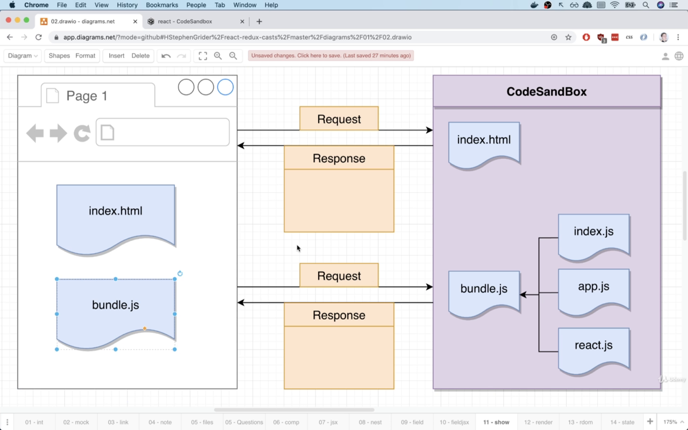
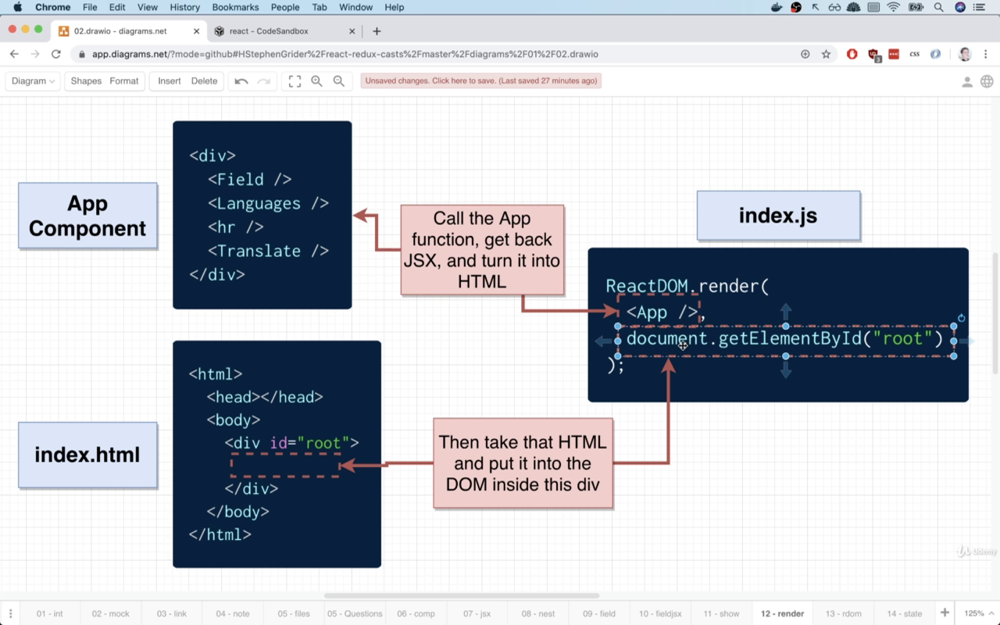

<div align="center">


# React

</div>
<!--
## Table of contents

- [Introduction](#introduction)

<br>

### Introduction -->

1. How does a react app knows what content to initially display on the screen?

    <details><summary><b>Answer</b></summary>

    
    

    1. first the `index.html` is rendered
    2. the `index.html` has `bundle.js` which renders multiple files including `index.js`
    3. `index.js` renders both, our `App` component and tells it specifically where to render which is inside the element with id root in my `index.html`

    </details>

2. Diffrence between JSX and HTML

    <details><summary><b>Answer</b></summary>

    1. translating inline style

        ```HTML
            <div style="background-color:red;"></div>
        ```

        ```jsx
            <div style={{backgroundColor:'red'}}></div> //first curly braces indicates js variable  and the inner indicates js object
        ```

    2. changing class to className

        ```HTML
            <label class="label">enter your name</label>
        ```

        ```jsx
            <label className="label">enter your name</label>
        ```

    3. jsx can reference js variables/function that would return some text

        ```jsx
            const labelText ="enter your name"

            <label className="label">{labelText}</label>
        ```

        ```jsx
            function  text(){
                return "hi I'm text"
            }

            <button>{text()}</button>
        ```

        ```jsx
            const btnTxt = { text: 'Miss me?' };
            <button style={style}>{btnTxt.text}</button>

        ```

    </details>

3. what are props/properties and how to use them?

    <details><summary><b>Answer</b></summary>

    props is a system for passing data from parent to child component, the goal is to communicate data from parent to the child with ultimate goal of customizing the child component

    1. provide information from parent to child by writing prop name and value on the parent

    2. receive these props in the child first argument with props object and refer to to the values sent in the jsx such that it will look like `props.PropertyNameProvidedFromParent`

    >NB : it's conventional in react that the argument used to receive props data in the child component is named props

    </details>

4. How to send a component as a prop to another component?

    <details><summary><b>Answer</b></summary>
    instead of making a self-closing component `<component/>`
    make a component with a start and ending tag `<component></component>`
    and to send a component as a prop put it between the opening and closing tags for example

    ```jsx
       <ApprovalCard>
            <CommentDetail
                author='Joey'
                date='Yesterday 11:00 AM'
                text='naaahhhhh'
            />
        </ApprovalCard>
    ```

    you then recieve that component from the children key of the props object ie. `props.children` ... <strong>without this your child component won't show up inside its parent!!!</strong>


    </details>

    <!-- <details><summary><b>Answer</b></summary>

    </details> -->
