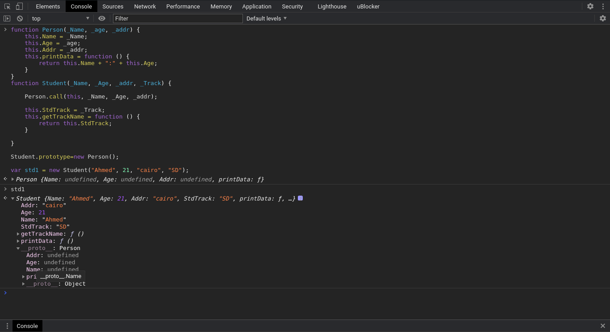
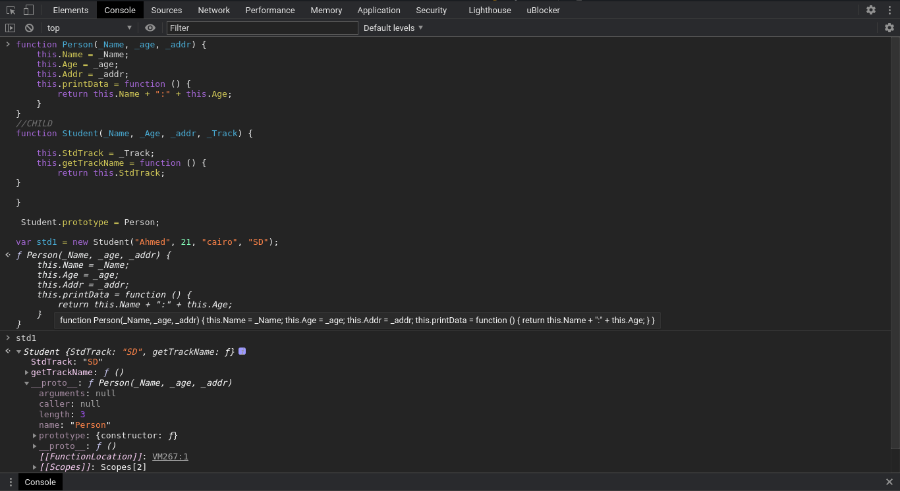
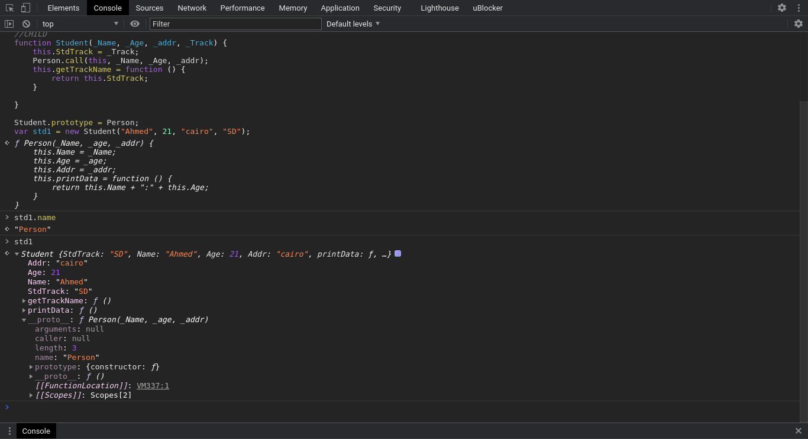

<div align="center">
  
<h1>Javascript</h1>
</div>

<h2>Table of contents<h2>

- [Introduction: (lec 1 advanced JS: not complete)](#introduction-lec-1-advanced-js-not-complete)
- [(lec 2 advanced JS)](#lec-2-advanced-js)
- [Inheritance & Prototype: (lec 3 advanced JS)](#inheritance--prototype-lec-3-advanced-js)
- [this Keyword with Bind(), call() & apply()](#this-keyword-with-bind-call--apply)
- [Arguments:](#arguments)
- [Every, some ,map, filter and other useful functions](#every-some-map-filter-and-other-useful-functions)
- [Ajax & xml request:](#ajax--xml-request)


<br>

## Introduction: (lec 1 advanced JS: not complete)

Primitive Data types: string,number,boolean,null,undefined

What does it mean for a variable to be primitive?

Anything in JS is being dealt with as an object, these data types are assigned to the window object directly as they don't have a parent object that they are created from

```js
var x="123";
console.log(x); //123
console.log(window.x); //123
```

```js
var y=null;
typeof y//object;

var z;
typeof z//undefined
y==z //true ==>both has absent of value meaning
y===z // false .. case is different with strict equality as it checks for the vakue and the datatype

```

```js
var str=new String("madia");//memory (size of object)
var str="madia";
```

difference between the first case where I used the constructor way and the literal way of creating a string like the second example is the memory allocated to both.
in case of using a constructor more memory is being consumed as it's creating an identical instance with all the properties it find in the parent it's created from

the literal way depends in it's creation on th built in function in js, it doesn't inherit the properties from string object.

NB: primitive variable can be converted to an object from the same type IN RUN TIME ONLY by simply adding a dot after it's name, it's being wrapped into an object but not a real object

```js
str._____
```

to remove a property in runtime
```js
var book = {
    Name: "JS",
    "Version": 2,
    Edition: 1.2,
    published: false,
    publishedDate: new Date(),
}

delete publishedDate

//outpout

/**
*   var book = {
*    Name: "JS",
*    "Version": 2,
*    Edition: 1.2,
*    published: false,
**/
```
to check if a property exists in object

```js
published in book //true
```

to return all the keys from an object
```js
Object.keys(book) //return array of the properties in book object

// or

for (key in book){
    console.log(key)
    console.log(book[key])// if i wanted to retrieve the values for the keys
    console.log(book.key)// returns 7 undefined as it looks up for a property called key
}

for(key in book){
    if(typeof book[key] !=="function")
    console.log(book[key]); //get all props values
}
```

<br>

## (lec 2 advanced JS)

## Inheritance & Prototype: (lec 3 advanced JS)

```javascript

function Person(_Name, _age, _addr) {
    this.Name = _Name;
    this.Age = _age;
    this.Addr = _addr;
    this.printData = function () {
        return this.Name + ":" + this.Age;
    }

}

    var p1=new Person("A",23,"C");
    p1.getAddressData=function(){
        console.log(p1.Addr);
    }

    var p2=new Person("B",24,"G");

    p1.getAddressData() // returns C
}
```

```javascript
/**
** the problem here is that I want to getAddressData from p2
** as well but it's only defined on p1 instance, to solve this issue
** we add the function to the prototype of the main object like this
**/


function Person(_Name, _age, _addr) {
    this.Name = _Name;
    this.Age = _age;
    this.Addr = _addr;
    this.printData = function () {
        return this.Name + ":" + this.Age;
    }

}

    var p1=new Person("A",23,"C");
    // p1.getAddressData=function(){
    //     console.log(p1.Addr);
    // }

    var p2=new Person("B",24,"G");


    Person.prototype.getAddressData=function(){
        console.log(this.Addr);
    }
    p1.getAddressData() // returns C

    p2.getAddressData() // returns G

}

```

<br>
<br>
 what if i wanted to inherit the properties from Person

 Constructor function in a new const Constructor
 ,How Can that be achieved?

<br>

```javascript
// method 1

//PARENT
function Person(_Name, _age, _addr) {
    this.Name = _Name;
    this.Age = _age;
    this.Addr = _addr;
    this.printData = function () {
        return this.Name + ":" + this.Age;
    }
}

//CHILD
function Student(_Name, _Age, _addr, _Track) {
    // Step B: Call the parent constructor in the child' so It would carry the uninitialized values
    Person.call(this, _Name, _Age, _addr);
//this here ↑ refers to the Student constructor,
//_Name, _Age, _addr are coming from Student constructor and are sent to Person constructor that's .call job here
    this.StdTrack = _Track;
    this.getTrackName = function () {
        return this.StdTrack;
    }

}
// Step A: make the prototype of the child equals to the parent
Student.prototype=new Person();

var std1 = new Student("Ahmed", 21, "cairo", "SD");


// NB if you  set the variables in person to a static values( this.Name = 'jack richer'), it will always override the value sent with the instances from your child

```

we tend to use this method as it's the only one that shows which properties belong to the parent and which belongs to the child
```js
//method 2

//PARENT
function Person(_Name, _age, _addr) {
    this.Name = _Name;
    this.Age = _age;
    this.Addr = _addr;
    this.printData = function () {
        return this.Name + ":" + this.Age;
    }
}
//CHILD
function Student(_Name, _Age, _addr, _Track) {
    // NO CALL HERE
    this.StdTrack = _Track;
    this.getTrackName = function () {
        return this.StdTrack;
}

}

 Student.prototype = Person;
var std1 = new Student("Ahmed", 21, "cairo", "SD");
```

It will inherit the values from person but I can't initialize them from my instance
```js
//method 3

//PARENT
function Person(_Name, _age, _addr) {
    this.Name = _Name;
    this.Age = _age;
    this.Addr = _addr;
    this.printData = function () {
        return this.Name + ":" + this.Age;
    }
}

//CHILD
function Student(_Name, _Age, _addr, _Track) {
    this.StdTrack = _Track;
    Person.call(this, _Name, _Age, _addr);
    this.getTrackName = function () {
        return this.StdTrack;
    }

}

Student.prototype = Person;
var std1 = new Student("Ahmed", 21, "cairo", "SD");


// You can also use .setPrototypeOf() or .Create()
// Object.setPrototypeOf(Student, Person);
```


<h5>NB</h5>
```std1.name``` refers to parent constructor (does not always exist)

```javascript
//method 4
//PARENT
Function Person(_Name, _age, _addr) {
    this.Name = _Name;
    this.Age = _age;
    this.Addr = _addr;
    this.printData = function () {
        return this.Name + ":" + this.Age;
    }
}

//CHILD
function Student(_Name, _Age, _addr, _Track) {
    this.StdTrack = _Track;
    Person.call(this, _Name, _Age, _addr);
    this.getTrackName = function () {
        return this.StdTrack;
    }

}
var std1 = new Student("Ahmed", 21, "cairo", "SD");
// you can even make an instance directly without making a prototype, as long as you're using Person.call to refer to the parent constructor, you use .prototype for more prototyping initialization so that std1 parent is the person not the student
```

```js
// NB:
function Newfun(){
        this.A="";
        this.B="";
    }
    Newfun.prototype.getAg=3;
    var f1 = new Newfun();
    // Newfun.prototype={ // this is a wrong way to initialize variables on the prototype chain, getAg became like the parent object to Newfun  in this case
    //     getAg:20
    // }
    var f2=new Newfun();

    g1.getAg //3
    g2.getAg //20
```
```js
function Newfun(){
        this.A="";
        this.B="";
    }
    Newfun.prototype.getAg=3; //this is the right way to initialize variables on the prototype chain

    var f1 = new Newfun();
    var f2=new Newfun();

    g1.getAg //3
    g2.getAg //3

```


## this Keyword with Bind(), call() & apply()

```javascript
_Name = "B"
        var myObj = {
            _Name: "A",
            printName: function () {
                console.log(this._Name);
            }
        }
//Q1
obj.printName();
//caller obj ==>this refers to myObj, output A

//Q2
var print = myObj.printName;
print();
//print equals the function
// print equals console.log(this._Name)
//caller here is window/global object, returns B

```
<br>

```javascript
/**
** Q:So How would we keep the value of this then? so it won't refer to different objects on different scenarios?
** A: Bind()
**/

    var print2 = myObj.printName.bind(myObj);
    // this refers to the caller object but here I deliberately said here's your parent object it's myObj
    print2(); // returns A

```
```javascript
    var obj2 = {
        _Name: "new naame"
    }
    var print2 = obj.printName.bind(obj2); // your parent is obj2
    print2(); // return new naame
```
<br>

```javascript
// as you have seen bind is used to call function from an object on another object, this is powerful and can be used in many ways

var str = "Hello World";
var str2 = str.slice(0,6);
console.log(str2) //returns "Hello " ... this is normal string slice

var str3 = Array.prototype.slice.bind(str);
console.log(str3())
//returns ["H", "e", "l", "l", "o", " ", "W", "o", "r", "l", "d"] ... this is array's slice

```
[Bind() vs Call() vs Apply()](https://stackoverflow.com/questions/15455009/javascript-call-apply-vs-bind#15455043)

>Answer in SIMPLEST form

> * Call invokes the function and allows you to pass in arguments one by one.
> * Apply invokes the function and allows you to pass in arguments as an array.
> * Bind returns a new function, allowing you to pass in a this array and any number of arguments
>
Use .bind() when you want that function to later be called with a certain context, useful in events. Use .call() or .apply() when you want to invoke the function immediately, and modify the context.


***They all attach this into function (or object)*** and the difference is in the function invocation (see below).

<mark>call</mark> attaches this into function and executes the function immediately:

```javascript
var person = {
  name: "James Smith",
  hello: function(thing) {
    console.log(this.name + " says hello " + thing);
  }
}

person.hello("world");  // output: "James Smith says hello world"
person.hello.call({ name: "Jim Smith" }, "world"); // output: "Jim Smith says hello world"
```
<mark>bind</mark> attaches this into function and it needs to be invoked separately like this:

```javascript
var person = {
  name: "James Smith",
  hello: function(thing) {
    console.log(this.name + " says hello " + thing);
  }
}

person.hello("world");  // output: "James Smith says hello world"
var helloFunc = person.hello.bind({ name: "Jim Smith" });
helloFunc("world");  // output: Jim Smith says hello world"

```
or like this:

```javascript
var helloFunc = person.hello.bind({ name: "Jim Smith" }, "world");
helloFunc();  // output: Jim Smith says hello world"
```

<mark>apply</mark> is similar to call except that it takes an array-like object instead of listing the arguments out one at a time:

```javascript
function personContainer() {
  var person = {
     name: "James Smith",
     hello: function() {
       console.log(this.name + " says hello " + arguments[1]);
     }
  }
  person.hello.apply(person, arguments);
}
personContainer("world", "mars"); // output: "James Smith says hello mars", note: arguments[0] = "world" , arguments[1] = "mars"
```

<br>

```javascript
    var str = "Hello World";
    var newarr=    Array.prototype.map.call(str,function(elem){
        return elem;
    });
    newarr //["H", "e", "l", "l", "o", " ", "W", "o", "r", "l", "d"]
```

```javascript
 var sorted=    Array.prototype.sort.call(str,function(a,b){return a-b;})
    sorted //returns an error because change my default object and strings are immutable so I can't change their values once initialized
```

```javascript
    Math.min([23,4,57,8,9]); //NAN

/*
func.apply(thisArg, [ argsArray])
thisArg : The value of this provided for the call to func.

Note that this may not be the actual value seen by the method: if the method is a function in non-strict mode code, null and undefined will be replaced with the global object, and primitive values will be boxed. This argument is required.

Return value
The result of calling the function with the specified this value and arguments.

Note: While the syntax of this function is almost identical to that of call(), the fundamental difference is that call() accepts an argument list, while apply() accepts a single array of arguments.

Note: When the first argument is undefined or null a similar outcome can be achieved using the array spread syntax.

*/

    Math.min.apply(null,[23,4,57,8,9]); //4
```

## Arguments:

```javascript
    var Res = 0;

    console.log(Sum(2, 3, 4)); //9

function Sum() {
    console.log(arguments);

    for (var i = 0; i < arguments.length; i++) {
        Res += arguments[i];
    }
    return Res
}

```
```javascript

   // eval(arguments.join("+"));  returns an error as join is used with array while arguments is not an array

    var arr = [2, 3, 4, 6];
    console.log(eval(arr.join("+"))); //returns 15 but it's not recommended to use eval because it has interpret the data inside into javascript?? 🤨🤨 >>>> instead use reduce to make operation on values of array
```
```javascript
function sum(){

    Res = arr.reduce(function (total, elemnt) {
        return total += elemnt;
    })

    return Res;
}

sum(2, 3, 4, 6) //returns 15
```
```javascript
//what if I wanted to use arguments instead of an array?
sum(2, 3, 4, 6)

function sum(){
    console.log(Array.prototype.slice.call(arguments)); //[2, 3, 4, 6]
    console.log("Summation",
        Array.prototype.slice.call(arguments).reduce(function (t, e) {
            return t += e; //Summation 15
        })
    )
}
```

## Every, some ,map, filter and other useful functions
```javascript
var arr = [3, 45, 6, 8, 2, 30, 40];
    var r= arr.filter(function(a){  //return array elements act conditions
        return a>10
    })

//some : if at least one of array elements achieve condition return true

var r = arr.some(function (a) {
            return a > 10 //return true
        })

//every: all array element achieve condition

var r = arr.every(function (a) {
            return a > 10 //return false
        })

// return new array after applying the function on each element of the original array

var r=arr.map(function(a){
            return a>10
        })
```

```javascript

    var str="  mo salah      "; //"mo salah"
    str.trim()  //remove space from left and right, also there's trimLeft() and trimRight() if you wanted to trim spaces from one direction only

    str.repeat() //""
    str.repeat(2) //"  mo salah        mo salah      "

    console.log(Array.prototype); //return all builtin functions on Array object
    console.log(String.prototype); //return all builtin functions on String object
    console.log(Number.prototype); //return all builtin functions on Number object

```

<br>

## Ajax & xml request:

```javascript

// getting data from .txt file

    var xhr = new XMLHttpRequest(); //create XML object

    xhr.open("get", "instructors.txt");//open .. get is a method calling, instructors.txt is location of the file I'm using, here it's in the same directory so I said the name of the file directly, this file contain 1 array filled with multiple objects

    xhr.onload = function () { //this will be applied after the file is received (from server, considering we use a server here)

        // console.log(xhr.responseText) //return text file
        // console.log(xhr.responseText[0]) //return first character in my file, (we where trying to get first object instead)
        ;
        res = JSON.parse(xhr.responseText); //solution : convert it into  javascript object

        console.log(res[0]) //return first element successfully

        console.log(xhr.responseURL);// return the location of the file in my device, usually with server 404 ,501 ,200 ..etc
        for (var i = 0; i < res.length; i++) {
            newtr = "<tr>";

            var tdsvals = "<td>" + res[i]._id + "</td><td>"+res[i].firstName+"</td><td>"+res[i].salary+"</td>";

            newtr += tdsvals+"</tr>";

            document.getElementById("_data").innerHTML+=newtr //adding the data from the file somewhere in my html file
        }

    }
    xhr.send();//calling //send my request
```

```javascript
// getting data from .XML file

        var xhr = new XMLHttpRequest();
        xhr.open("get", "bookstore.xml");
        xhr.withCredentials=true; //access ==cors//backend end access
        xhr.onload = function () {

            //  console.log(xhr.responseText); //return text implementation of the file

            //  console.log(xhr.responseXML);  //return XML implementation of the file not javascript!

            // console.log(JSON.parse(xhr.responseText); //return an error as my file format is not object like , solution is to wrap it into a jquery object

             var bookStor = $(xhr.responseXML).children(); //I have one direct child only in my file which is a bookstore tag, it wraps inside it multiple book tags, each wrap inside multiple properties tags for each book

             console.log(bookStor)

             var books = bookStor.children("book");//return array of books

             for (var i = 0; i < books.length; i++) {
                 newtr = "<tr>";
                // nb: you are selecting xml tags, you're not bounded by your html tags in selection here .. hence selecting book the line below
                 var tdsvals = "<td>" + $(books[i]).children("title").text() + "</td><td>" + $(books[i]).children("price").text() + "</td>";
                 newtr += tdsvals + "</tr>";
                 document.getElementById("_data").innerHTML += newtr
             }

             console.log(xhr.responseXML[0]);
             console.log(JSON.parse(xhr.responseXML));//error
        }

```

<h5>NB:</h5>
you convert string to json using JSON.parse and convert it back to string using Stringify

```javascript
var obj = '{"o":22,"a":25}'
JSON.parse(obj) //{o: 22, a: 25}

var parse = JSON.parse(obj)
JSON.stringify(parse) //"{"o":22,"a":25}"
```

```javascript
    // return html document
    var r = new XMLHttpRequest();

    r.open("post", "targetpage.html") //method post, targetpage.html is a page in my directory
    r.onload = function () {
        console.log($(r.responseText)); //wraped it into jquery object the same as with xml files
    }
    r.status()// returns 404,500,200 ..etc

    r.onreadystatechange=function(){

    }


    r.setRequestHeader("content-type","appliction/txt"); // incase I'm sending data to the server - post method -
    var obj={
        ID:23,
        Name:"AMDMFMFM"
    }
    r.send(JSON.stringify(obj));


 r.onerror=function(erro){ //incase there's an error do this callback function
        console.log(erro)
    }
        })
// NB: nobody is using xml like this anymore :'(
```
```javascript
// ajax is short asynchronous (not on the same time) javascript and xml
 $.ajax({
        url:"instructors.txt", //the place I'm getting data from
        method:"get",
        // withcertion: //used when your file and the file you're getting data from are on different servers
        // type:"text", //type of data ..uncommon
        // dataTyp:, //type of data sent .. uncommon
        // headers:{
        //     "content-type":"appliction/json" .. uncommon
        // }
        success:function(res){
            console.log(JSON.parse(res));
        },
        error:function(erro){
            console.log(erro)
        }

```
```javascript

```
```javascript

```
```javascript

```
```javascript

```
```javascript

```
```javascript

```


