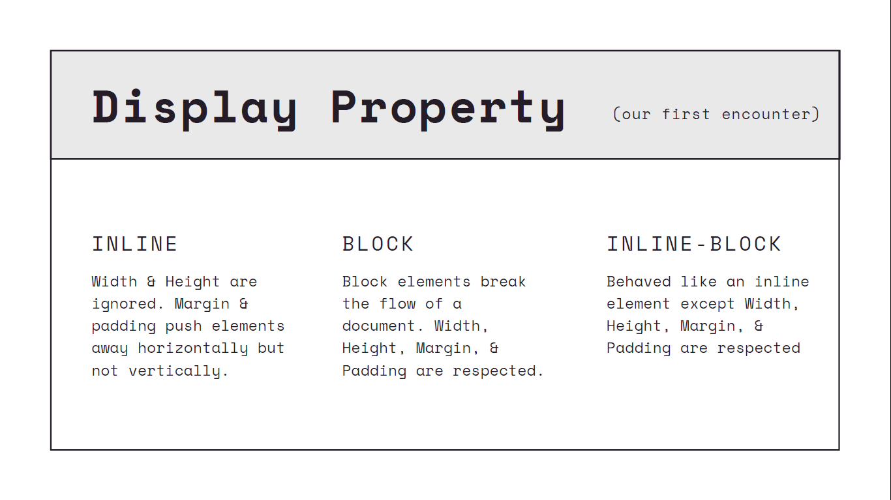
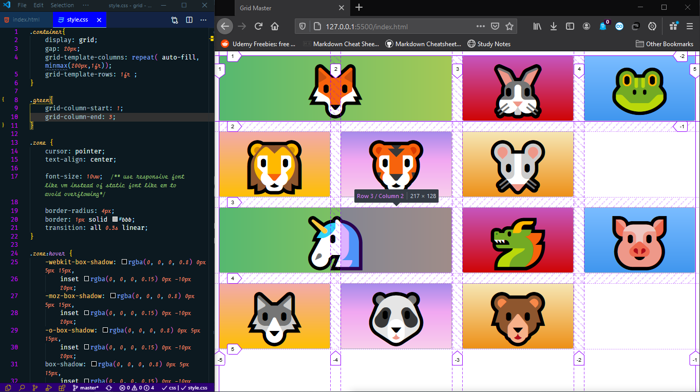

<div align="center">
    
    <h1>CSS</h1>
</div>

<h2>Table of contents<h2>

- [Units](#Units)
- [inline-block](#inline-block)
- [Attribute selectors](#attribute-selectors)
- [Position](#Position)
- [Flexbox](#flexbox)
- [Flexbox Vs CSS Grid](#flexbox-vs-css-grid)
- [CSS Grid](#css-grid)

<br>

## Units

when dealing with relative units ```em``` with padding/margin, the padding/margin is calculated relative to the element font-size meaning .... if the element's font-size is 30px and you define a padding for this element with 1em then the elements padding is 30px

## inline-block:

<br>

`display: inline-block` brought a new way to create side by side boxes that collapse and wrap properly depending on the available space in the containing element. It makes layouts that were previously accomplished with floats easier to create. No need to clear floats anymore.

<br>

what is the difference between inline and inline-block?

<details><summary><b>Answer</b></summary>
<p>

Compared to <b>display: inline </b>, the major difference is that inline-block allows to set a width and height on the element. Also, with display: inline, top and bottom margins & paddings are not respected, and with `display: inline-block` they are.

</p>
</details>

<br>

what is the difference between block and inline-block?

<details><summary><b>Answer</b></summary>
<p>

the difference between `display: inline-block` and `display: block` is that, with <b>display: block</b>, a line break happens after the element, so a block element doesn’t sit next to other elements.

</p>
</details>

<br>



## Attribute selectors

```css
[data-value] {
	/* Attribute exists */
}

[data-value='foo'] {
	/* Attribute has this exact value */
}

[data-value*='foo'] {
	/* Attribute value contains this value somewhere in it */
}

[data-value~='foo'] {
	/* Attribute has this value in a space-separated list somewhere */
}

[data-value^='foo'] {
	/* Attribute value starts with this */
}

[data-value|='foo'] {
	/* Attribute value starts with this in a dash-separated list */
}

[data-value$='foo'] {
	/* Attribute value ends with this */
}
```

1. Attribute Exactly Equals Certain Value

```html
<h1 rel="external">Attribute Equals</h1>
```

```css
h1[rel='external'] {
	color: red;
}
```

Note on Quotes: You can usually get away without using quotes in attribute selectors, like [rel=external], but the rules for omitting quotes are weird and inconsistent across actual browser implementations. So, best practice, just use quotes, like [rel="external"]. It’s safer and always works.

<br>

2. Attribute Contains Certain Value Somewhere

```html
<h1 rel="xxxexternalxxx">Attribute Contains</h1>

<div id="post_1"></div>
<div id="post_two"></div>
<div id="third_post"></div>
```

```css
h1[rel*='external'] {
	color: red;
}

div[id*='post'] {
	color: red;
}
```

3. Attribute Begins with Certain Value

```html
<h1 rel="external-link yep">Attribute Begins</h1>
```

```css
h1[rel^='external'] {
	color: red;
}
```

4. Attribute Ends with Certain Value

```html
<h1 rel="friend external">Attribute Ends</h1>
```

```css
h1[rel$='external'] {
	color: red;
}

a[href$='.pdf'] {
	background: url(icon-pdf.png) left center no-repeat;
	padding-left: 30px;
}
a[href$='.doc'] {
	background: url(icon-doc.png) left center no-repeat;
	padding-left: 30px;
}
```

5. Attribute is within Space Separated List

```html
<h1 rel="friend external sandwich">Attribute Space Separated</h1>
```

```css
h1[rel~='external'] {
	color: red;
}
```

You might be thinking, why would I use this when _= would also match this and be more versatile? Indeed it is more versatile, but it can be too versatile. This selector requires the spaces around the value where as _= would not. So if you had two elements one with `rel=home friend-link` and one with `rel=home friend link` you are going to need the space-separated selector to target the second one properly.

<br>

6. Attribute is the start of a Dash Separated List

```html
<h1 rel="friend-external-sandwich">Attribute Dash Separated</h1>
```

```css
h1[rel|='friend'] {
	color: red;
}
```

Note that even though it matches based on the start of the selector, the entire first part of the string before the first dash needs to match. So in the above example, if the `rel` attribute was `friend2-external-sandwich`, it would not be a match while the `^=` attribute selector would have.

<br>

7. Multiple Attribute Matches

```html
<h1 rel="handsome" title="Important note">Multiple Attributes</h1>
```

```css
h1[rel='handsome'][title^='Important'] {
	color: red;
}
```

Vital to note is that you can use multiple attribute selectors in the same selector, which requires all of them to match for the selector itself to match.

8. Case-Insensitive Attribute Selectors

```css
/* Will match
<div data-state="open"></div>
<div data-state="Open"></div>
<div data-state="OPEN"></div>
<div data-state="oPeN"></div>
*/
[data-state='open' i] {
}
```

9. Using Attribute in CSS

```css
.el::before {
	content: attr(data-prefix) ': ';
}
```

```css
.el {
	/* <div class="el" data-font-size="18"> */
	font-size: attr(data-font-size px);

	/* <div class="el"> */
	font-size: attr(data-font-size px, 18px);
}
```

## Position

NB: positioning an element with `Sticky` works the same as fixed would but it keeps it's position in the working flow till you scroll past it then it's gets fixed on your screen

## Flexbox:


- ```flex direction```
	- Is used to configure the **main axis** in flexbox
	- It takes the values ```row```, ```row-reverse```,```column```,```column-reverse```

- ```justify content```
	- determines how the content is distributed across the **main axis**.
	- It takes the values ```flex-start``` , ```flex-end``` , ```center```, ```space-between```, ```space-around```, ```space-evenly```

- `flex-wrap`
	- Is used wrap content inside it's container if it didn't have enough space instead of shrinking
	- It takes the values `wrap`, `no-wrap` & `wrap-reverse`, it changes **cross axis** direction

- ```align-items```
	- Determines how the content is distributed across the **cross axiI**.
	-  it takes the values ```flex-start``` , ```flex-end```, ```center```, ```stretch```, ```baseline```

- `align-content`
	-  Controls or distribute space along the cross axis, **but only when we have multiple rows or columns**
	-  It takes values   ```flex-start``` , ```flex-end``` , ```center```, ```space-between```, ```space-around```

> NB: If we only have one column or one row, we don't have flex wrap turned on, align content does nothing for us at all.

- `align-self`
	- is used to change the alignment along the **cross axis** for a single element using it.
	- This property is not applied to the flex container itself, but to the element.


- `flex-basis`
	- Set the initial width or height to the elements depending on the direction of my **main axis**. It overrides width/height properties values.
	- This property is not applied to the flex container itself, but to the element.

- `flex-grow`
	- control the amount of free space an element should take up, it allows element to expand to take the rest of available space in a it's container depending on the direction of it's **main axis**
	- It takes unit-less number value, the **higher** the number the **bigger** space it will take
	- This property is not applied to the flex container itself, but to the element.
	- default  value is 1.

- `flex-shrink`
	- If items are larger than the container, they shrink according to flex-shrink. Elements shrinks depending on the direction of the **main axis**
	- It takes unit-less number value, the **higher** the number the **smaller** space it will take
	- This property is not applied to the flex container itself, but to the element.
	- default  value is 1.

```css

/* the shorthand for the the 3 flex properties above */

/* One value, unitless number: flex-grow */
flex: 2;

/* One value, width/height: flex-basis */
flex: 10em;
flex: 30%;
flex: min-content;

/* Two values: flex-grow | flex-basis */
flex: 1 30px;

/* Two values: flex-grow | flex-shrink */
flex: 2 2;

/* Three values: flex-grow | flex-shrink | flex-basis */
flex: 2 2 10%;

```

<br>

what is the difference between align-items and align-content?

<details><summary><b>Answer</b></summary>
<p>

`align-content` determines the spacing between lines, while `align-items` determines how the items as a whole are aligned vertically within the container. When there is only one line, `align-content` has no effect.

</p>
</details>

<br>

## Flexbox Vs CSS Grid


## CSS Grid


> NB: use responsive unit (vw) and (fr) with grid to avoid horizontal ruler/scrolling

- `gap` is used to define the gap between columns in grid
- `grid-template-columns` is used to define number of columns in the grid


- `grid-template-rows` : is used to define how much space a row should occupy in the grid

- `repeat(2 ,2fr)` is translated to `2fr 2fr`


- `auto` is translated to fill min width and min hight that could fit the content


- `justify-items` is used to control how an element should behave horizontally when it has extra space

- `align-items` is used to control how an element should behave vertically when it has extra space


- `repeat( auto-fill, minmax(200px,1fr))`
	- `auto-fill` adjust the number of column accordingly to the available viewport available width and the specified width
	- `minmax(200px,1fr)` the minimum width for the column is 200px and it can expands till it's max width is not greater than 1fr


- `grid-column` is short hand for `grid-column-start` and `grid-column-end`
- `grid-column : 1/-1` will make the element to take full viewport width




- `grid-column: 2 span` will expand to cover 2 spans width


- `grid-row: 1/4` will expand to cover for 4 row height

> NB: when we had 2 elements with green class and `grid-row: 1/4` this resulted that the 2 elements be at the top  page as they both had `grid-column-start: 1`


- `justify-self` and `align-self` are used to change the behavior of an element horizontally and vertically


[Grid Cheatsheet](https://grid.malven.co/)

